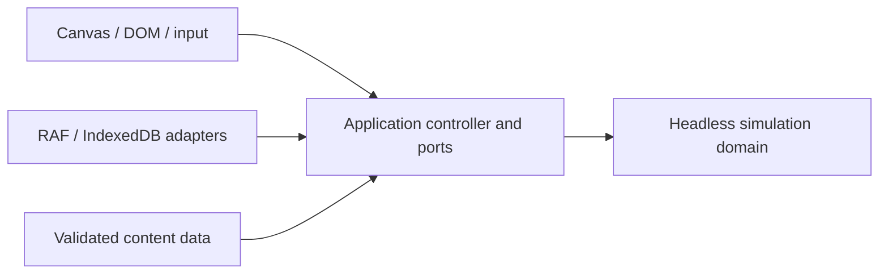

# Implementation Plan: TowerSim First Playable MVP

**Branch**: `001-playable-tower-mvp` | **Date**: 2026-09-09 | **Spec**: [spec.md](spec.md)
**Input**: Current clarified specification and the technical planning request.
**Status**: Gameplay and Phase 19 implementation delivered; final release qualification remains blocked by the measured reference-performance and open native/player gates. See [tasks](tasks.md) and [release evidence](../../docs/release-evidence.md).

## Summary

Build a static browser game with a strict TypeScript simulation, a small application controller, Canvas 2D world rendering, and DOM controls. The first playable loop is construction → automatic tenancy → individual travel → elevator congestion → additional shafts → income → Level 2 → exact local continuation. Keep the simulation runnable in Vitest without browser APIs. Use no frontend framework or production runtime dependency.

The simulation uses one-second fixed ticks, an indexed scheduled-event heap, sleeping occupants, logical floor ranges, a portal navigation graph, and one eight-person car per shaft using the accepted directional sweep. Plain persistent records are separate from reconstructible indices. Cars, shafts, service definitions, routes, and dispatch decisions have separate identities/boundaries so later transport work can extend them without changing existing person or queue identities. No advanced elevator behavior is implemented in this MVP.

Supporting artifacts: [research](research.md), [data model](data-model.md), [contracts](contracts/README.md), [quickstart](quickstart.md), and [validation strategy](validation.md). Production code and `tasks.md` are outside this planning command.

## Technical Context

| Area | Decision |
| --- | --- |
| Language/version | TypeScript 7.0.2 strict mode; selected toolchain versions and official compatibility sources are recorded in research. Separate domain and browser compiler projects. |
| Primary dependencies | Development only: TypeScript, Vite 8.2.2, Vitest 5.0.0, matching Node types; Node 24 LTS tooling. No large frontend framework, rendering library, state manager, pathfinding package, scheduler package, or persistence wrapper. |
| Storage | Browser-native IndexedDB through an application-owned `SaveRepository` port. One explicit local save slot initially. |
| Testing | Vitest in Node for unit, story integration, determinism, serialization, and benchmark harnesses. Actual stable Chrome, Firefox, and Safari for platform and visual evidence. |
| Target/project | Single-player desktop web application; pointer and keyboard; static assets; no backend or authentication. |
| Simulation time | 1 tick = 1 simulated second; integer absolute ticks. Normal 120 ticks/real second; fast 480; very fast 960; pause 0. |
| Randomness | Versioned `xoshiro128**` PRNG with four uint32 state words, canonical 128-bit seed parsing, saved current state and fixed golden vectors. No direct `Math.random()` in simulation. |
| World configuration | Default width 120 cells, ground 0, min floor 0, max floor 40; bounds, funding, content, speeds, and demand come from a persisted scenario snapshot. |
| Rendering | One Canvas 2D world surface; camera pan/zoom and pixels live outside GameState. Cached static layers plus visible active occupants and queues; DOM panels subscribe to queries. |
| Persistence | JSON-compatible save envelope v1; strict field and invariant validation, content/rules compatibility, paused load, no offline advancement. Reject unsupported versions; no fictional pre-v1 migration. |
| Browsers/deployment | Vite production assets with relative base, locally bundled resources and no gameplay service dependency. Test then-current stable browser versions on recorded hardware. |
| Performance goals | Spec SC-012: 13 floors, 24 offices, two restaurants, three shafts, 2,000 scheduled people, ≥500 active. ≥30 FPS for 95% of normal-speed one-second intervals; p95 UI/access ≤150 ms; save/load each ≤2 s; published accelerated rates sustained. |
| Constraints | No DOM per person/facility/cell; no per-frame pathfinding or full dormant-population scans; safe integer currency; deterministic decisions; no unbounded histories. |
| Scale/scope | Independently benchmark 100/1,000/5,000 active people and large dormant populations. Only the two initial facility types, stairs, standard elevators, one milestone, and local continuation are playable scope. |

### Reconciliation with the request

The requested ten-second tick is an initial research hypothesis, not retained: it cannot represent one-second passenger transfers without coarse behavior or an additional sub-tick simulator. A one-second tick gives a simple integer timebase; performance remains a measurement gate, not a claim. Research compares 10/5/1-second alternatives.

The request calls 60 simulated seconds per real second a likely normal rate. The clarified specification already fixes a full day at 12 real minutes, which is 120 simulated seconds per real second. Preserve that accepted balance default, with 4×/8× acceleration, and keep it in application pacing configuration. A future switch to 60 requires synchronizing the spec, onboarding timings, and session tests, not changing domain ticks.

For one-/two-floor trips, minimize walking distance to the first usable stair or elevator entrance, then generalized total journey cost and stable ties. Longer trips prefer a route containing elevator travel when available. Queue congestion alone does not override that long-trip preference. Existing saved stairs-preference journeys retain their commitments until completion.

## Constitution Check

Pre-research review: **PASS at design level**, based on the requested separation and existing spec; no exception is needed. Post-design review: **PASS at design level** against the artifacts below. These passes evaluate the design, not completed implementation tests. Constitution 1.0.0 remains unchanged.

| Principle/gate | Design and earliest required evidence | Pre / post |
| --- | --- | --- |
| I: clean-room originality | Original code, shapes, wording, and data; `docs/provenance.md` records asset/code licenses. Research describes general algorithms, not proprietary game internals. Source/provenance review begins in slice A. | Pass / Pass |
| II: simulation boundary | Domain compile excludes DOM/Node globals and forbids platform imports; injected data and ordered domain commands only. Node tests construct and advance a tower in slice A. | Pass / Pass |
| III: determinism | Integer ticks, explicit phase order, saved RNG state/counters, stable ID ties and seeded schedules. Golden vectors and replay hashes in A, multi-day/save continuation expanded in D/E. | Pass / Pass |
| IV: logical world | Configured bounds and integer logical ranges; pixel/camera conversions only in presentation. Round-trip camera and placement invariance checks in A. | Pass / Pass |
| V: transportation | Real walking/stair edges, stops, queues, separate shafts/cars, finite loads, timed transfers, denied boarding, dispatch port. Travel and congestion evidence in B/C. Future multi-car/service interfaces add no advanced behavior now. | Pass / Pass |
| VI–VII: hybrid/lightweight people | Indexed heap wakes dormant records; active traversal/car/queue indices; timestamps for queue age; no dormant scans per tick or DOM entities. Scheduler and active/dormant profiling in A/B. | Pass / Pass |
| VIII–IX: state and data | Discriminated occupant/car/tool/load states, stable IDs, composable data definitions and persisted rules snapshot. Transition/invariant tests in each owning slice. | Pass / Pass |
| X: emergent metrics | Timed trip segments and denial events feed bounded live/cohort/day reports. Empty, abandoned and stranded cases tested in C; formula and coefficients documented in data. | Pass / Pass |
| XI: economy | Safe integer minor units; explicit transactions/accruals; bounded ledger with reconcilable archived totals. Exact rounding and daily settlement tests start in A and complete in D. | Pass / Pass |
| XII: save contract | v1 plain records; validated candidate then one application swap; transaction-complete acknowledgement; failed writes retain prior slot. Round-trip and rejection tests start with state foundation, all active phases in E. | Pass / Pass |
| XIII: browsers/static output | Vite static build, relative asset URLs, no remote gameplay dependency. Browser smoke and static serving from A; actual three-browser acceptance and disconnection exercise in E. | Pass / Pass |
| XIV: performance | Spec budgets plus isolated 100/1,000/5,000 benchmarks; bounded route cache/history; visible-only rendering; profile before workers, ECS, incremental graph edits or LOD. Evidence begins A and repeats after C/E changes. | Pass / Pass |
| XV–XVI: playable/understandable | Five runnable slices with unit/integration/UI evidence owned at the point behavior appears. Native APIs and small explicit data structures; no speculative systems. | Pass / Pass |

No gates are inapplicable. Browser/device observations, benchmarks, and new-player evaluation remain explicitly unverified until implementation.

## Project Structure

### Documentation (this feature)

```text
specs/001-playable-tower-mvp/
  spec.md
  plan.md
  research.md
  data-model.md
  quickstart.md
  validation.md
  contracts/
    README.md
    simulation.md
    navigation-transport.md
    persistence.md
    presentation.md
  checklists/requirements.md
```

`tasks.md` will be generated separately by `$speckit-tasks` after review. The existing specification and clarification checklist remain inputs.

### Planned source layout

```text
src/
  app/
    commands/                 # browser-intent translation and ordered command ingress
    game/                     # session lifecycle, pacing, queries, load/save orchestration
    ports/                    # SaveRepository, presentation/clock adapters
  simulation/
    commands/                 # domain command/result types and validation
    core/{clock,events,random,ids}/
    world/
    construction/
    facilities/
    occupants/
    navigation/
    transportation/{elevators,stairs}/
    economy/
    demand/
    progression/
    metrics/
    state/                    # plain state, invariants, pure save DTO validation
    index.ts                  # narrow public domain API
  content/{facilities,schedules,progression,scenarios}/
  rendering/{canvas,camera,layers}/
  input/
  ui/
  persistence/                # IndexedDB adapter only
  platform/                   # RAF, visibility, browser feature probes
  main.ts                     # shared mountGame composition root; no auto-mount on import
  styles.css
index.html
tsconfig.json
tsconfig.simulation.json
tsconfig.browser.json
tsconfig.tests.json
vite.config.ts
vite.browser.config.ts        # separate production-mode browser-test build
vitest.config.ts
vitest.benchmark.config.ts
tests/
  unit/
  integration/
  fixtures/
  benchmarks/
  browser/                    # platform harness/manual evidence instructions
scripts/                      # architectural check and reproducible benchmark entrypoint
  check-browser-builds.mjs     # release/test build isolation and shared application settings
public/                       # only locally owned/approved static assets
```

A single project is sufficient. Domain imports only domain modules; `content/` exports plain definitions supplied by the composition root. Application imports domain APIs and declares platform ports. Presentation/platform imports application ports and read-only domain types. No dependency flows from simulation to application, content loaders, persistence adapters, or rendering. Build-time checks enforce the graph, not naming convention alone.



The composition root wires adapters to application ports; arrows show the direction of imports/contracts, not permission to mutate state.

## Architectural Decisions

### Authoritative state and time

`GameState` is plain serializable records with schema/rules/content identifiers, absolute clock, seed and current RNG state, monotonically allocated IDs, tower geometry, facilities/tenants, lightweight people, shafts/cars/queues, active trip measures, economy, demand, progression, metrics, pending events, and durable command/event ordering counters. Runtime indices, heap storage, graph objects, cached paths, Canvas objects, browser storage handles, and UI selection are outside it.

Only completed simulation boundaries may be snapshotted. Domain advancement consumes a requested integer count of ticks and ordered commands. It never reads a wall clock. The [simulation contract](contracts/simulation.md) defines same-time phases, initial 06:00 review, arrivals/departures, midnight accounting, commands while paused, and next-day evaluation.

The application uses a monotonic platform clock, a real-time accumulator, and bounded work batches. At 8× it owes 960 one-second ticks per real second. Preserve outstanding tick debt while a foreground session is running; yield between batches for input/rendering and report actual speed if behind. Never skip domain ticks or scale movement rules. Visibility loss explicitly pauses the session and resets the real-time anchor without adding hidden time; resuming requires the player to resume. No hidden-tab catch-up or offline simulation. Paused build commands can settle accrued finance and invalidate routes, but cannot age a trip.

### World, placement, and navigation

Store constructed space as sorted disjoint half-open ranges per floor. Adjacent ranges normalize into one interval. Store facility rectangles and separate shaft reservations in logical integer cells; derive sorted per-floor reservation intervals and owner-ID lookup indices. Occupancy excludes the implicit shared hallway, which remains passable alongside facilities/shafts. Full support beneath every new upper-floor cell is mandatory.

Build a sparse portal graph at meaningful floor/entrance/stair/stop points. Connected hallway neighbors have walk edges; stairs have explicit adjacent-floor edges; elevator board/ride/alight edges distinguish queue admission from riding without an all-pairs stop graph. A topology edit validates a proposed result, protects occupied edges/cars and supporting floors, rebuilds the graph synchronously once, increments its version, and invalidates bounded route templates. In-flight travelers retain explicit valid segment endpoints/progress, not pointers to old graph nodes. Rebuild and cache decisions are justified in research.

Use deterministic Dijkstra with integer generalized costs and stable ties. Cache static walking/stair paths and connectivity by topology version and goal/mode, not a dynamic winning shaft. Evaluate current queue/capacity estimates on boarding edges at route decisions, with all eligible shafts still searchable. Waiting passengers reassess useful added shafts after topology changes, in stable order, without losing their history or teleporting to a new stop. No periodic or per-frame path searches.

### Transportation and occupants

Occupants are discriminated logical states and a location union, with one physical location at a time. People inside offices/restaurants sleep until departure/visit-end events. Active walkers and stair users advance on ticks; queues use explicit admission-order entries and timestamps; riding people derive motion from their car without independent movement scans. Departed transient customers are retired after bounded reporting requirements; workers retain identity for later feasible days.

Retirement is owned by `src/simulation/occupants/retirement.ts`, introduced for former workers in T043 and extended for customers in T116. At completed lifecycle boundaries, remove a departed former worker/customer, or a never-entered canceled one, only after clearing live queue/car/event/route/active-trip references and preserving the required historical records. Ordinary leased workers remain available for later days; active, inside, exiting and stranded people are never cleanup candidates. Historical trip/cohort identifiers, processed service-visit references and financial source labels do not require retaining a live person object. Deferred office market release remains independently represented until its next review. Cleanup follows relevant transitions rather than scanning the population each tick, and allocated IDs are never reused. T074/T124 verify repeated-day retention, while T136/T137 verify that historical references survive saving without resurrecting retired people.

One standard car belongs to each shaft. Stops are records distinct from the shaft, car, and hall queues. An internal `DispatchPolicy` consumes a read-only request view and returns a next target/direction. Only the fixed collective sweep ships. Constant travel segments plus fixed start/leveling overhead are sufficient; do not introduce acceleration physics or configurable dispatch. Door opening/closing and dwell take nonzero time; unloading/boarding takes one tick per person, with empty passenger phases skipped at the same boundary. Full cars still make eligible requested stops and record denials, as required by the spec.

Each queue is scoped to a service stop and requested direction. Trip waiting history survives migration, but joining a different service takes a new local FIFO place; actual queue time only accrues while waiting. A capacity denial occurs once for an eligible person left behind during that car visit. An added elevator receives demand through generalized-cost routing, not a building-count quality bonus. The contract includes queue admission cutoffs so late arrivals cannot create endless boarding or undefined denial events.

### Demand, finance, progression, and reports

At 06:00, lease eligible offices in stable facility order against finite worker capacity; default tenant acquisition needs no random market simulation. Generate schedules in stable worker order using the domain PRNG abstraction. Restaurant daily demand is a separate finite allocation with ≥70% of requests in 11:30–13:30. External arrivals enter at the lobby; no office lunch-trip subsystem.

Finance uses safe integer minor units and explicit posted transactions. Accrual tracks eligible ticks and rounds once on day settlement or demolition, preserving pending earned amounts across access changes. Keep inspectable recent transactions, rolling totals, and an archived reconciliation checkpoint so history does not grow indefinitely. A zero-cost demolition may settle liabilities into negative cash. Daily settlement precedes progression evaluation.

Trip records accumulate walking, stairs, queue time, car time, transfers, denials, and outcome. Bounded recent finished trips plus all unfinished trips produce the 60-minute live view; cohort and completed-day summaries retain all required people and sample counts. A configurable simple penalty model weights waiting and denials more heavily than ordinary riding. Coefficients are provisional balance data and must satisfy the monotonic and congestion tests; no architectural tuning claim is made.

Level 2 evaluates the exact spec criteria using full-day maintained counters/minima, admitted restaurant visits, completed office arrival samples, post-settlement cash/net, quality, stranded counts, and unresolved prior-day trips. It is a permanent one-time award. No building-count-only shortcut or transportation unlock is introduced.

### Browser, UI, and persistence

Canvas renders background, structure, facilities, transport, visible occupants/queues, previews, and optional debugging in layers. Cache static geometry in ordinary offscreen HTML canvas surfaces; redraw it on topology/content/zoom invalidation. Pixel ratio, camera transformations, render interpolation, and selection never enter domain state. DOM panels use stable elements and query updates, not an element per facility/person; panels update on changes or a bounded real-time cadence.

Input owns an explicit tool state machine. A pointer position becomes a logical proposal; preview uses the same pure domain validation as commit. Application commands also include speed, selection, Save/Load/New Game, but only tower/gameplay commands reach the domain. Use read-only query results for inspectors and congestion overlays.

The first walking-person slice includes `src/input/occupant-selection.ts` and one reusable `src/ui/occupant-inspector.ts`, backed by `src/app/game/occupant-queries.ts`. T041 supplies Canvas selection, identity/type/goal/state text and retained selection while the worker is inside or dormant, with behavioral tests before M2/T042. T085 extends this existing inspector with transportation measurements rather than introducing the initial inspection UI.

Save captures a detached completed-boundary DTO, validates/encodes outside an IndexedDB transaction, and replaces one slot atomically. Acknowledgement comes from transaction completion. Load reads/validates a detached candidate, rebuilds derived indices, asks about unsaved replacement only after validation, then swaps one session reference and starts paused. The current session and last valid slot survive failures. Native browser tests cover Safari transaction lifetime, unavailable/quota-limited storage, upgrade blocking, and refresh/reopen; Node tests alone cannot qualify IndexedDB.

### Browser-test build and release evidence

The release entry `index.html` calls the shared `mountGame` composition function exported by `src/main.ts` with ordinary new-game inputs. Importing that module does not mount a second application. The separate `tests/browser/index.html` entry imports the same function and supplies a validated scenario or completed-boundary state before play. Its fixtures use normal domain construction/lease/schedule paths; after mounting, observation and interventions use ordinary application controls. Release modules do not import fixtures or the test harness.

`vite.browser.config.ts` shares the release production mode, browser target, environment and application settings, but uses `tests/browser` as its root and repository-root `dist-browser-test/` as its output. Resolve its environment/public-asset directories from the repository root so changing the entry root does not change application inputs. Its built page is served at `/`; `dist/` remains the separate release output. T003 owns `build:browser-test`, `preview:browser-test` and `check:browser-builds` package scripts, while T005 owns the config/harness and `scripts/check-browser-builds.mjs`. Both setup tasks must finish before these commands run. The checker verifies distinct output roots, the absence of fixture/harness modules from the release bundle graph, and matching application source/build settings. The test bundle is not a deployment artifact.

Every browser checkpoint smoke-tests release `dist/`; prepared-state observations additionally use the separately built production-mode test bundle and label that evidence accordingly. Once Save/Load exists, reference-state qualification uses an explicit local save from the harness, then serves release `dist/` at the exact same origin/profile and loads through ordinary UI. Native storage, sustained sessions, new-player evaluation and final performance qualification must establish release-artifact evidence. The exact commands and same-origin handoff are in [validation.md](validation.md).

### Development diagnostics

Expose a development-only application query with tick/date, seed and current RNG words, active/dormant counts, pending event count, per-car phase/load, queue lengths, navigation version/cache counters, average wait/denials, actual ticks processed per real second, and RAF FPS. Domain exposes counts and plain state only; wall-clock counters and debug panels belong to application/platform. Gate imports with Vite development flags so production does not depend on debugging.

## Delivery and Validation Sequence

| Slice | Runnable result | Evidence owned in the slice |
| --- | --- | --- |
| A: deterministic construction shell | New game, Canvas camera, floor/facility previews, inspect/demolish, clock controls, cash ledger, headless core. | Strict boundary/import checks; world/support/collision/camera tests; PRNG vectors; event ordering; financial command atomicity; save DTO foundation; static build and three-browser smoke. |
| B: destinations and stairs | Automatic office leasing, seeded distributed worker journeys, physical presence, early person inspection, sleeping/wakeup, stairs, access/stranding recovery. | Office schedules, occupant transitions/selection, former-worker retirement, navigation/cache invalidation, inaccessible leases, safe edits, pause/FPS independence; active/dormant benchmarks. |
| C: real elevators and congestion | One-car shafts, doors/travel/queues, inspectors, traffic reports, useful added capacity. | Dispatch/capacity/denial/state tests; both controlled and continuous-play congestion comparisons; monotonic quality and cross-speed determinism; transport profiling. |
| D: complete management loop | Restaurant lunch demand/revenue, daily settlement, bounded finance/reporting, Level 2. | Customer allocations/visits/retirement, repeated-day occupant retention, exact rounding and ledger reconciliation, full-day milestone pass/fail conditions, continued-worker identity, full mixed journey. |
| E: durable continuation and release evidence | Save/load/new-game replacement UI, interrupted writes, complete platform qualification. | All active-phase round trips, malformed data and failed writes, three seeds × three days replay, actual browser sessions/disconnection, SC-012 benchmarks, five-new-player checks for SC-001/002/004, provenance and static release review. |

Persistence invariants and serialization tests begin in A and grow with each stateful slice; E is the integrated browser-storage and release qualification, not the first save-contract check. Each slice ends runnable, with its checks complete or explicitly reported as unmet. [validation.md](validation.md) maps all unit-test topics, stories, success criteria, benchmark methodology, and evidence ownership.

## Phase Outcomes and Handoff

Phase 0 resolves all 16 requested research decisions in [research.md](research.md), including alternatives, primary sources, and dependency choices. Phase 1 produces the model, contracts, quickstart, and validation design. Phase 2 defines the above implementation sequence for later task generation; this command does not generate tasks or production files.

Before implementation, capture exact package versions in the lockfile, create the planned scripts, and turn the documented deterministic fixtures into executable tests. Begin performance sampling early; do not add workers, ECS storage, incremental graph surgery, complex dispatch, or LOD without an observed bottleneck and a correctness-preserving comparison.

## Complexity Tracking

No constitution violations are proposed. The indexed heap, derived reservation intervals, sparse graph, bounded cache, and per-system active indices solve explicit cancellation, placement, route, and scale requirements. They are small internal modules with direct tests; they do not authorize a generic plugin framework or speculative optimization.
