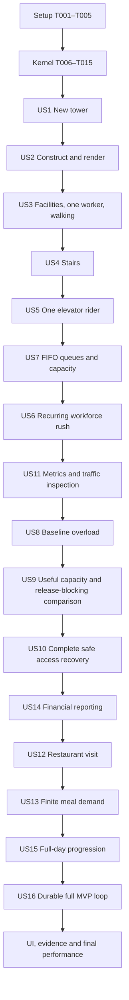

# Tasks: TowerSim First Playable MVP

**Input directory**: `/Users/oberon/Projects/coding/javascript/TowerSim/specs/001-playable-tower-mvp/`
**Required inputs**: [plan.md](plan.md), [spec.md](spec.md), [research.md](research.md), [data-model.md](data-model.md), [contracts/README.md](contracts/README.md), [quickstart.md](quickstart.md), [validation.md](validation.md), and [constitution](../../.specify/memory/constitution.md).
**Status**: Phase 1/2 (T001–T015) and Phase 3/4 implementation (T016–T022, T024–T029) completed on 2026-09-10. T023/C0 and T030/M1 have supplemental in-app-browser observations but remain unchecked pending actual Chrome/Firefox/Safari qualification. Phase 5 onward remains backlog. Automated, browser and benchmark evidence is recorded in `docs/release-evidence.md` and the linked checkpoint reports.

## Execution rules

- Paths in tasks are relative to the repository root above. New source/test/evidence files are planned outputs, not claims that they exist.
- Run tasks in ID order unless an explicit parallel window below permits otherwise. `[P]` means separate files and no dependency on the other tasks in that window; it does not bypass phase prerequisites. `[USn]` maps to the original specification story, even where dependency order differs from story number.
- For every task introducing authoritative behavior, **write its listed behavioral tests first, observe the relevant failure, implement the behavior, then pass the tests before marking the task complete**. Separate contract-test tasks may intentionally establish failing cases for the immediately following implementation tasks. No playable checkpoint may have unexplained failing tests.
- Every new persistent field/state must extend `src/simulation/state/game-state.ts`, the pure codec/validator in `src/simulation/state/codec.ts` and `src/simulation/state/validate-state.ts`, and `tests/integration/state-roundtrip.test.ts` in its introducing task. Preserve canonical state after reconstruction, current RNG/counters, pending events, and committed movement. Browser storage waits until US16; serialization correctness does not.
- Every construction subtype uses the same pure preview/commit rules, atomic integer ledger, and topology-change boundary. Rejection may consume command-sequence metadata only; it must not consume entity IDs/RNG or change money, geometry, events, people, or routes. Add occupied-state guards when that state first becomes possible.
- At every browser checkpoint, run `npm run check:types`, `npm run check:boundaries`, relevant tests, and `npm run build`; serve release `dist/` with `npm run preview` and exercise the available ordinary-player slice in actual stable desktop Chrome, Firefox, and Safari. Prepared-fixture observations additionally use `npm run build:browser-test`, `npm run check:browser-builds`, and `npm run preview:browser-test` to serve the separate production-mode `dist-browser-test/` bundle. Follow the build/serve and later same-origin local-save handoff in `validation.md`; native storage and final release qualification run against `dist/`, not solely the harness. Record artifact kind/hash, exact versions, seed, build/content/rules identity, observations and unmet checks. Missing browsers/manual evidence leave that checkpoint unchecked; headless results remain separately reportable. Evidence collection never implies publishing/deployment authorization.
- Original Canvas shapes and original wording are sufficient. Update `docs/provenance.md` when introducing content/assets or third-party reference code. No proprietary-game assets, frontend framework, production runtime dependency, backend, advanced dispatch, capacity upgrades, or multi-car shafts are authorized.
- All constitutional evidence categories apply. Pre-v1 migrations are not applicable because there is no supported pre-v1 save; test explicit rejection. Backend/network API tests are not applicable because these are local TypeScript boundaries.

## Delivery order and checkpoints

The plan's A–E slices are divided into smaller runnable increments. Setup/foundation contains only the deterministic kernel and narrow money/serialization primitives. Logical construction precedes its full visualization; basic Canvas appears with the initial site. US3 includes the minimum people/scheduling/navigation needed to watch a worker walk before stairs. Queue mechanics (US7) precede full office rushes (US6); reporting (US11) precedes overload/improvement (US8–9); financial reporting (US14) precedes restaurant demand (US12–13). US10 completes disruption cases after transport exists. These are actual dependencies, not changes to story priority or scope.

| Checkpoint | Task | Visible, independently verifiable result |
| --- | --- | --- |
| C0: initial site | T023 | New paused tower, lobby, camera, seed/cash/level/time, working speed controls. |
| M1: construct and render a tower | T030 | Build two supported upper floors and extend one; inspect, pan/zoom and reject invalid placement without charges. |
| M2: watch one occupant walk | T042 | One scheduled worker enters the lobby, walks to an office, sleeps inside, then walks out; presence changes only on physical admission/exit. |
| C1: stairs | T053 | Walk–stair–walk journey to an adjacent floor and understandable access repair. |
| M3: watch one elevator rider | T064 | One occupant calls, waits, boards, rides, unloads and walks to an office; pause freezes every phase. |
| M4: watch an elevator queue | T072 | Nine occupants visibly queue; eight board and the ninth retains its wait and receives a denial. Mixed worker/customer acceptance closes in T119. |
| C2: recurring office rush | T079 | Distributed morning/evening demand, sleeping workers and no overnight duplication. |
| C3: diagnose traffic | T087 / T092 | Truthful scoped reports and the visibly growing baseline backlog. |
| M5: reproduce congestion acceptance | T098 / T100 | Required deterministic comparison passes, then ordinary construction visibly improves a continuing tower. |
| C4: recover access | T107 | Remove safe access, see real stranding, restore it and watch people leave. |
| C5: operating finances | T113 | Reconciled balances, accrued demolition settlement and usable negative-cash play. |
| C6: restaurant meal wave | T120 / T125 | Physical customer visits, one payment per admission and finite concentrated daily requests. |
| C7: management loop | T133 | Build, lease, transport, diagnose/improve, earn, feed restaurant demand and attain Level 2. |
| M6: full MVP game loop | T144 | Complete C7 through ordinary UI, save active traffic, refresh/reopen, load paused and continue. |
| Release qualification | T145–T154 | UI/evidence completion, new-player/session checks and measured final performance budgets. |

Each phase has an independent test using validated prepared state; this does not mean stories have no code dependencies. Cross-story acceptance clauses are explicitly closed later (for example US4's elevator fallback in T061 and US1's storage replacement in T140–T144). An early checkpoint is a runnable subset, not a claim that every acceptance clause or the whole MVP is done.

## Phase 1: Setup

**Goal**: Reproducible static TypeScript project and runnable validation entrypoints.

- [X] T001 Initialize Node 24 LTS tooling in `package.json`, `package-lock.json`, `.nvmrc`, `index.html`, `src/main.ts`, and `vite.config.ts`; pin the plan's TypeScript 7.0.2, Vite 8.2.2, Vitest 5.0.0 and compatible Node types after checking availability/compatibility, use `base: './'`, and provide dev/preview scripts without runtime dependencies; expose a bootstrap `mountGame` entry from `src/main.ts` without auto-mounting on import, invoked by release `index.html` and extended with actual game composition in T022; document any necessary toolchain correction in `specs/001-playable-tower-mvp/research.md` before relying on it.
- [X] T002 Configure strict domain/browser/test projects in `tsconfig.json`, `tsconfig.simulation.json`, `tsconfig.browser.json`, and `tsconfig.tests.json`; implement `scripts/check-boundaries.mjs` and its forbidden-import/global fixtures in `tests/fixtures/boundaries/` to reject static/dynamic domain imports of app, content loaders, UI/rendering/platform/persistence/Vite plus browser, wall-clock and direct random APIs; wire `check:types`, `check:boundaries`, and checked `build` in `package.json`.
- [X] T003 [P] Configure isolated Node unit/integration suites in `vitest.config.ts` and serial benchmarks without coverage in `vitest.benchmark.config.ts`; create `scripts/run-benchmarks.mjs`, `tests/benchmarks/harness.ts`, and npm test/test:integration/bench scripts in `package.json` with three warmups, ten restored-snapshot trials, metadata/JSON output, and digest agreement assertions; also wire `build:browser-test` to checked `vite build --config vite.browser.config.ts --mode production`, `preview:browser-test` to `vite preview --config vite.browser.config.ts`, and `check:browser-builds` to `node scripts/check-browser-builds.mjs`; their config/checker are owned by parallel T005 and execute after the setup join.
- [X] T004 [P] Record independent code/content/shape authorship, development dependency licenses, permitted PRNG reference attribution, and excluded proprietary assets in `docs/provenance.md`; add a source/asset review procedure in `docs/release-evidence.md` without claiming qualification.
- [X] T005 [P] Establish the separate native-browser test build in `vite.browser.config.ts`, `tests/browser/index.html`, and `tests/browser/harness.ts`: root it at `tests/browser`, emit repository-root `dist-browser-test/`, inherit release production mode/target/environment settings with environment/public-asset directories resolved from the repository root, and import the same `mountGame` entry from `src/main.ts`; fixture initialization becomes playable at T022 and may supply validated starting data only before play. Implement `scripts/check-browser-builds.mjs` to verify distinct output roots, no fixture/harness modules in the release bundle graph, and shared application source/build settings; ignore generated test output in `.gitignore`, and document exact commands/artifact identity in `tests/browser/README.md` and `tests/browser/evidence/template.md`. Do not modify `package.json` in this task; T003 owns its scripts.

**Checkpoint**: `npm run build` produces a static bootstrap and all planned command entrypoints exist; no gameplay is claimed yet.

## Phase 2: Foundational deterministic kernel

**Goal**: Advance headless state through deterministic committed boundaries without building entire subsystem layers.
**Independent test**: Repeat a seeded ordered command/tick script, serialize/rebuild and compare canonical state with identical integer accounting and no browser imports.

- [X] T006 Implement safe-integer ticks, logical coordinates, checked arithmetic and immutable kind-prefixed ordinal IDs in `src/simulation/core/values.ts` and `src/simulation/core/ids/allocator.ts`; test overflow-before-mutation and numeric ordinal ordering (including IDs 2 and 10) in `tests/unit/core-values.test.ts`.
- [X] T007 [P] Implement versioned `xoshiro128ss-v1`, canonical 32-hex seed parsing, uint32 transition, bounded rejection sampling and current-state import/export in `src/simulation/core/random/xoshiro128.ts`; test independently established golden vectors, malformed/all-zero state rejection and resumed sequences in `tests/unit/random.test.ts`.
- [X] T008 [P] Implement typed future events and the indexed min-heap in `src/simulation/core/events/event.ts` and `src/simulation/core/events/scheduler.ts`; test total due/phase/sequence order, fresh reschedule ordinals, cancel-by-ID/owner, generation checks, physical removal, index consistency and deterministic rebuild in `tests/unit/scheduler.test.ts`.
- [X] T009 Define the initial plain state/scenario contracts, immutable compatibility identifiers, durable allocation counters and derived-runtime boundary in `src/simulation/state/game-state.ts`, `src/simulation/state/scenario.ts`, and `src/simulation/state/runtime.ts`; test JSON-compatible value restrictions, supported capabilities and isolated state instances in `tests/unit/state-contract.test.ts`, adding subsystem records only when their owning tasks introduce them.
- [X] T010 Define ordered command envelopes, typed results/errors, pure validation/query boundaries and the narrow public API in `src/simulation/commands/types.ts`, `src/simulation/commands/ingress.ts`, and `src/simulation/index.ts`; test stale ticks, duplicate sequences, rejected-command sequencing and read/preview nonmutation in `tests/unit/command-ingress.test.ts`.
- [X] T011 Implement integer tick advancement and explicit six-phase completed-boundary processing in `src/simulation/core/clock/advance.ts` and `src/simulation/core/events/phases.ts`; test `advance(0)`, first-positive-advance 06:00 bootstrap, future-only scheduling, one phase-0 midnight owner, same-tick ordering, no double advancement of newly active work and deterministic failure boundaries in `tests/unit/advance.test.ts`.
- [X] T012 Implement safe integer minor-unit posting, unique transaction identities and exact half-away-from-zero prorating primitives in `src/simulation/economy/money.ts` and `src/simulation/economy/ledger.ts`; test overflow, signed half-unit rounding, replay idempotency and initial-cash-plus-events reconciliation in `tests/unit/money-ledger.test.ts`; defer operating policy/reporting to the owning stories.
- [X] T013 Implement detached boundary capture, strict current-state validation and deterministic derived reconstruction in `src/simulation/state/codec.ts`, `src/simulation/state/validate-state.ts`, and `src/simulation/state/rebuild-derived.ts`; start `tests/integration/state-roundtrip.test.ts` with current RNG, counters, pending bootstrap/events, canonical ordering and invalid/version-mismatched DTO rejection, without browser storage or fictional migrations.
- [X] T014 Build explicit seed/command/tick fixture helpers and canonical authoritative digests in `tests/fixtures/seeds.ts`, `tests/fixtures/replay.ts`, and `tests/fixtures/canonical-state.ts`; use three nonzero 128-bit seeds to test segmented advancement, shuffled derived insertion order and capture/rebuild equality in `tests/integration/kernel-determinism.test.ts`.
- [X] T015 Measure event bursts, repeated schedule/cancel cycles and boundary advancement using `tests/benchmarks/kernel.bench.ts`; record actual heap size, trial digests and timing metadata in `docs/performance/kernel.md`, verifying canceled-event storage stays bounded before people/transport are added.

**Checkpoint**: Headless creation/commands/ticks/capture are testable; foundation is complete before story implementation.

## Phase 3: US1 — Start a New Tower (P1)

**Goal**: Open a valid paused site and control the same simulation at all published speeds.
**Independent test**: Fresh configured scenario shows permanent lobby, funds, seed, Level 1, bounds and 06:00; pause/speed/visibility and New Game cancellation preserve the specified state.

- [X] T016 [P] [US1] Write application/presentation contract cases in `tests/integration/session-contract.test.ts` for ordered domain ingress, immutable query views, pause/edit behavior, visibility suspension, replacement cancellation and no duplicate runner; use injected ports from `specs/001-playable-tower-mvp/contracts/presentation.md` rather than real browser timing.
- [X] T017 [P] [US1] Define validated immutable starting content in `src/content/scenarios/mvp-default.ts`, `src/content/facilities/definitions.ts`, `src/content/schedules/profiles.ts`, and `src/content/progression/level2.ts`; expose all planned prices, footprints, timing/windows, finite demand and targets from data, and verify the stated starter construction plus full-day operating allowance is affordable in `tests/unit/starter-budget.test.ts`.
- [X] T018 [US1] Implement configured base ranges/permanent entrance and new-game state in `src/simulation/world/tower.ts` and `src/simulation/state/create-game.ts`; test nondefault width/floor bounds, valid lobby support, initial cash/level/seed, no occupants or lease income and pending-only initial review in `tests/integration/new-game.test.ts`.
- [X] T019 [US1] Implement injected pacing and generation-owned platform scheduling in `src/app/game/pacing.ts`, `src/app/ports/clock.ts`, and `src/platform/frame-driver.ts`; test 120/480/960 ticks per real second, fractional remainder, bounded batches without dropped foreground debt, frozen pause, visibility auto-pause/explicit resume and no hidden-time catch-up in `tests/unit/pacing.test.ts`.
- [X] T020 [US1] Implement one `GameSession`, unsaved revision tracking, New Game cancellation/discard and small read-only HUD/world projections in `src/app/game/session.ts`, `src/app/commands/dispatch.ts`, and `src/app/game/queries.ts`; pass `tests/integration/session-contract.test.ts`, including that starting another tower has no storage-write effect and discards only the old session's timing debt.
- [X] T021 [US1] Implement basic lobby/site Canvas drawing and invertible camera transforms in `src/rendering/canvas/renderer.ts`, `src/rendering/layers/structure.ts`, and `src/rendering/camera/camera.ts`; test world/CSS-pixel inversion across pan, zoom, resize and device pixel ratios in `tests/unit/camera.test.ts`, keeping every display value outside domain state.
- [X] T022 [US1] Compose the site, HUD, named build-tool palette, scenario prices/windows, time buttons and New Game flow through the shared `mountGame` function in `src/main.ts`, with `src/ui/hud.ts`, `src/ui/toolbar.ts`, and `src/styles.css`; release `index.html` supplies default new-game inputs, while `tests/browser/harness.ts` may supply a validated scenario or completed-boundary state before mounting the same application. Keep fixture imports and mid-play mutation controls outside the release entry graph; test single-session mounting and invalid prepared-state rejection in `tests/integration/session-contract.test.ts`, wire platform-generated seeds through the parser, show selected speed and pending features honestly until their later tool handlers land, and retain keyboard focus/text labels.
- [ ] T023 [US1] Verify checkpoint C0 in `tests/browser/evidence/us01-start.md`: start/cancel/discard New Game, inspect the paused site and navigate it, run each speed/pause/visibility mode, and serve the checked static build in the three actual supported browsers; mark full tool/storage acceptance as pending the later owning tasks.

## Phase 4: US2 — Construct Additional Floor Space (P1)

**Goal**: Construct and render useful supported floor spans with identical preview and commit rules.
**Independent test**: Build two upper floors and extend one; camera changes preserve a proposal, and invalid placement/demolition leaves money and geometry intact.

- [X] T024 [US2] Implement normalized half-open floor ranges, full support checks, adjacency merge and removable-span splitting in `src/simulation/world/ranges.ts` and `src/simulation/construction/floors.ts`; test partial overlap rejection, unsupported widening, configurable bounds, protected lobby/base and upper support dependencies in `tests/unit/floor-construction.test.ts`.
- [X] T025 [US2] Wire atomic floor construction/demolition commands and full quotes into `src/simulation/construction/transaction.ts` and `src/simulation/commands/floor-commands.ts`; test exactly-affordable success, zero/free demolition, once-only charges, overflow and rejected-command nonmutation in `tests/integration/floor-commands.test.ts`.
- [X] T026 [US2] Implement constructed-path/access primitives and topology revision notification in `src/simulation/world/walking-space.ts` and `src/simulation/world/topology-change.ts`; test touching spans versus gaps, buildable-but-inaccessible upper floors and one revision per accepted edit in `tests/unit/walking-space.test.ts`; later navigation extends these semantics without crossing gaps.
- [X] T027 [US2] Implement floor-tool states, logical pointer proposals, Escape cancellation and revision-aware revalidation through application ingress in `src/input/build-tool.ts`, `src/input/pointer.ts`, and `src/app/commands/construction.ts`; test camera-stable active proposals, stale previews and cancellation with no mutation in `tests/unit/build-tool.test.ts`.
- [X] T028 [US2] Render constructed spans, quoted valid/invalid previews and selection overlays using cached visible static layers in `src/rendering/layers/structure.ts` and `src/rendering/layers/preview.ts`; expose level/span/free-space/access explanations in `src/ui/floor-inspector.ts` without per-cell/facility DOM nodes or world-sized bitmaps.
- [X] T029 [US2] Complete `tests/integration/construct-tower.test.ts` using public commands to construct two upper floors, extend the supporting ground/floor chain, reject each invalid class and capture/rebuild the edited tower; add construction/cache/edit timing samples in `tests/benchmarks/construction.bench.ts` and `docs/performance/construction.md`.
- [ ] T030 [US2] Verify playable milestone M1 in `tests/browser/evidence/us02-construct-tower.md`: construct and render the test tower through ordinary controls, pan/zoom/resize to all built spans, inspect inaccessible floors and rejected quotes, and demonstrate safe eligible floor removal with a passing static build and browser checks.

## Phase 5: US3 — Place and Lease an Office (P1)

Implementation/headless validation completed 2026-09-10; T042/T047 remain open for full supported-browser evidence. See `docs/offices.md` and the Phase 5 evidence records.

**Goal**: Add facilities, leasing, minimum schedules and real same-floor walking as one runnable slice.
**Independent test**: A prepared valid scenario with one worker per office demonstrates the complete walking lifecycle; default content retains 32 workers per office. Separate finite-market fixtures prove tenancy, workforce, physical presence and rent eligibility.

### Facilities and leasing

- [X] T031 [P] [US3] Write office command/query contract tests in `tests/integration/office-contract.test.ts` covering placement/price, vacancy reasons, finite whole-workforce leasing, assigned-versus-present counts and access-dependent rent; establish the initial-review and midnight expectations from `specs/001-playable-tower-mvp/contracts/simulation.md` before handlers are implemented.
- [X] T032 [P] [US3] Implement per-floor reservation lookup and facility footprint/entrance creation in `src/simulation/world/reservations.ts` and `src/simulation/facilities/place-facility.ts`; test missing floor, rectangles, conflicts with planned transport reservation shapes, bounds, stable definitions/capabilities and preserved shared hallway in `tests/unit/facility-placement.test.ts`.
- [X] T033 [US3] Add the office placement/demolition tool, visible footprint and basic vacancy/access/rate inspector in `src/ui/office-inspector.ts`, `src/rendering/layers/facilities.ts`, and `src/input/facility-tool.ts`; route preview/commit through existing validators and retain the underlying floor on removal.
- [X] T034 [US3] Implement source existence/access accrual intervals and once-only daily/demolition settlement in `src/simulation/economy/accrual.ts` and `src/simulation/economy/settlement.ts`; hook the single phase-0 event and facility construction/removal, testing prorating once, rent before demolition, continuing inaccessible costs and negative-cash free demolition in `tests/unit/accrual.test.ts` and `tests/integration/settlement-boundary.test.ts`; later finance tasks add bounded reporting rather than duplicate billing.
- [X] T035 [US3] Implement stable office leasing, tenant/workforce identity, eligibility and market release at the next review in `src/simulation/facilities/offices.ts` and `src/simulation/demand/office-leasing.ts`; test the first 06:00 review only on positive advance, later-building deferral, whole-office market caps, access/level/demand vacancy reasons and rent independent of presence in `tests/unit/office-leasing.test.ts`.

### One occupant, a schedule and a real walking route

- [X] T036 [US3] Implement lightweight worker/customer location/state unions, legal transitions and derived active/dormant membership in `src/simulation/occupants/occupant.ts`, `src/simulation/occupants/transitions.ts`, and `src/simulation/occupants/active-index.ts`; test one location, no duplicate visit/active membership and facility sleeping/wakeup consistency in `tests/unit/occupant-transitions.test.ts`.
- [X] T037 [US3] Implement seeded initial worker arrival/departure goals and generation markers in `src/simulation/demand/office-schedules.ts` and `src/simulation/occupants/schedule-events.ts`; test fixed-seed times within 08:00–10:00 and 17:00–19:00, future-only events, no review/save/edit schedule duplication and departure precedence over same-tick admission in `tests/unit/office-schedules.test.ts`; recurring multi-day rush behavior is extended in US6.
- [X] T038 [US3] Implement per-trip measured segment opening/closing, separate visit/exit outcomes and elapsed-time queries in `src/simulation/metrics/trips.ts`; test once-only walking/waiting/stair/riding interval settlement, nonmutating open-segment age, abandonment and stranding history in `tests/unit/trip-segments.test.ts`; wire actual transitions as each movement mode lands, with aggregate scores deferred to US11.
- [X] T039 [US3] Implement canonical hallway/entrance portal graphs, semantic straight walk legs, deterministic Dijkstra and bounded static route caching in `src/simulation/navigation/graph.ts`, `src/simulation/navigation/find-route.ts`, and `src/simulation/navigation/route-cache.ts`; test gaps, adjacent spans, round-trip lobby access, integer half-tick ties, anchor-subdivision-neutral duration and eviction-neutral reachability in `tests/unit/walking-navigation.test.ts`.
- [X] T040 [US3] Integrate lobby entry, timed walking, physical office admission, dormant work and real exit into `src/simulation/occupants/walking.ts` and `src/simulation/occupants/facility-transitions.ts`; test walk–inside–walk–depart with one worker, nonzero duration, attendance only on admission, canceled/late goals and segment metric totals in `tests/integration/one-worker-walk.test.ts`.
- [X] T041 [US3] Create a validated one-worker same-floor scenario in `tests/fixtures/one-worker.ts` through ordinary construction/leasing/schedule paths and select it before play through `tests/browser/harness.ts`; render/query logical occupants in `src/rendering/layers/occupants.ts` and `src/app/game/occupant-queries.ts`, and add Canvas hit-selection plus a single reusable DOM inspector in `src/input/occupant-selection.ts` and `src/ui/occupant-inspector.ts`. Show stable identity, worker/customer type, goal and current state, retaining a selected worker's details while inside or dormant outside; test selection, pause, walking-to-inside-to-exit updates and query nonmutation in `tests/integration/occupant-inspection.test.ts` before M2, without sprite-owned rules or per-person DOM.
- [ ] T042 [US3] Verify playable milestone M2 in `tests/browser/evidence/us03-one-walker.md` after T041's inspector and tests pass: watch the same occupant enter, walk across constructed hallway beside facility footprints, work unseen but counted, and leave physically; select the walking worker on Canvas, read identity/type/goal/state through the ordinary inspector, retain the selection through the inside/exit transitions and pause mid-walk. Observe the validated one-worker fixture in `dist-browser-test/` and separately smoke-test the available default-content slice in release `dist/`, recording both artifact identities; use no manual position changes or invented attendance.

### Office lifecycle completion

- [X] T043 [US3] Integrate office access transitions and safe demolition in `src/simulation/facilities/office-lifecycle.ts`; test suspended/resumed rent with tenant retained, skipped inaccessible arrival slots, cancellation of unstarted visits, present-worker emergence at a surviving entrance, en-route abandonment and next-review market release in `tests/integration/office-lifecycle.test.ts`, clearing invalid future route references while preserving supported current legs. Introduce event-driven retirement in `src/simulation/occupants/retirement.ts` with `tests/unit/occupant-retirement.test.ts`: remove former workers only after real exit or cancellation before entry, retain ordinary leased workers and every active/stranded person, cancel live references before removal, preserve required historical trip/source identities and pending market release, never reuse IDs, and validate capture/rebuild after retirement without a population scan each tick.
- [X] T044 [US3] Finish office and market queries in `src/app/game/facility-queries.ts` and `src/ui/office-inspector.ts`; pass `tests/integration/office-contract.test.ts` and add `tests/unit/office-queries.test.ts` to reconcile lease/assigned/present counts, vacancy/suspension causes, next review, rates, accrued/recent income and available market without query mutation.
- [X] T045 [US3] Extend `tests/integration/state-roundtrip.test.ts` and `tests/fixtures/one-worker.ts` for scheduled workers, half-walks, inside-office wakeups and immediately invalidated route suffixes; rebuild cold indices with zero random draws and require identical next-day movement, tenant, event and finance outcomes to uninterrupted play.
- [X] T046 [US3] Benchmark identical active walking with increasing scheduled/inside dormant populations in `tests/benchmarks/occupants.bench.ts`; keep wakeups outside the measured interval, restore per trial, report actual active min/mean/max and digest equality in `docs/performance/occupants.md`, and remove accidental dormant scans before claiming this slice complete.
- [ ] T047 [US3] Verify office leasing/access/finance and the repeated one-worker slice in `tests/browser/evidence/us03-offices.md`, including vacant-versus-leased-versus-present labels, no instant rent on placement, skipped missed arrivals and an ordinary demolition/exit; retain M2's evidence and report only newly covered behavior.

## Phase 6: US4 — Connect Floors with Stairs (P1)

**Goal**: Connect adjacent landings and watch a physical walk–stair–walk journey.
**Independent test**: Connect a prepared upper-floor office to the lobby; see access change before routing/leasing, travel take time and occupied-segment demolition reject. Elevator fallback clauses close in T061.

- [X] T048 [P] [US4] Write stair/navigation boundary cases in `tests/integration/stairs-contract.test.ts` for adjacent existing free landings, immediate two-way access, positive traversal time, same-floor walking and short-trip preference; reserve elevator fallback cases for the concrete integration in T061 rather than faking elevator travel.
- [X] T049 [US4] Implement stair placement/reservations and graph edges in `src/simulation/transportation/stairs/stairs.ts` and `src/simulation/commands/stair-commands.ts`; test nonadjacent floors, missing/overlapping landings, atomic charges, full footprint support and non-obstructed hallways in `tests/unit/stair-construction.test.ts`.
- [X] T050 [US4] Implement timed stair traversal and safe edge completion in `src/simulation/transportation/stairs/traversal.ts`; integrate active indices/trip segments, testing nonzero up/down travel, no double movement, pause, one-location invariants and occupied-stair deletion rejection in `tests/unit/stair-traversal.test.ts`.
- [X] T051 [US4] Implement topology reconciliation for planned/current walk/stair legs and stranded exits in `src/simulation/navigation/reconcile-topology.ts`; test clear invalid suffixes, finish valid current segments, abandon unreachable visits, real surviving anchors and resume exits only after repair in `tests/integration/stair-access-recovery.test.ts`, including capture/rebuild while replan is pending.
- [X] T052 [US4] Add stair preview/commit, connection rendering and access causes in `src/input/stair-tool.ts`, `src/rendering/layers/stairs.ts`, and `src/ui/access-status.ts`; pass `tests/integration/stairs-contract.test.ts` and add `tests/integration/one-worker-stairs.test.ts` covering a leased accessible office, full journey, counts and metric reconciliation.
- [ ] T053 [US4] Verify checkpoint C1 in `tests/browser/evidence/us04-stairs.md`: construct stairs using ordinary tools, watch the occupant climb and descend, reject occupied removal, safely remove unoccupied access, inspect the cause and restore a real exit; record static-build/browser outcomes.

## Phase 7: US5 — Construct and Operate an Elevator (P1)

**Goal**: Carry one actual passenger through every physical elevator phase before increasing traffic.
**Independent test**: From valid landing floors, build one shaft with one eight-person car and watch one occupant walk, request, wait, board, ride, unload and enter the office. A single-passenger fixture limits demand, never the production capacity.

- [X] T054 [P] [US5] Write elevator/dispatch contract cases in `tests/integration/elevator-contract.test.ts` for separate shaft/car/service IDs, eight-person capacity, contiguous service, legal stopped/floor-crossing decisions, specified 2→3→5 reversal sequence and nearest/lower-floor idle pickup ties.
- [X] T055 [P] [US5] Write route-mode contract cases in `tests/integration/route-modes.test.ts` for same-floor walking, stairs for one/two floors, elevators for longer trips, valid opposite-mode fallback, immutable journey-origin preference and no queue-only stairs switch, using the public navigation contract.
- [X] T056 [US5] Implement shaft/stop/single-car construction and service-range validation in `src/simulation/transportation/elevators/shaft.ts` and `src/simulation/commands/elevator-commands.ts`; test aligned full-height reservations, at least two contiguous built landings, bounds/reversed/obstructed ranges, exactly one configured eight-person car, once-only price and recurring cost registration in `tests/unit/elevator-construction.test.ts`.
- [X] T057 [US5] Implement the read-only `DispatchPolicy` and fixed directional sweep in `src/simulation/transportation/elevators/dispatch-policy.ts` and `src/simulation/transportation/elevators/collective-sweep.ts`; test onboard commitments, compatible pickups, opposite-direction farthest reversal, skipped unrequested floors, full-car eligible stops and idle distance/floor/admission ties in `tests/unit/elevator-dispatch.test.ts`.
- [X] T058 [US5] Implement idle/start/move/level/open/dwell/close phases with persisted adjacent-segment progress in `src/simulation/transportation/elevators/car.ts`; test configured 2-tick start/level/doors/dwell, 4 ticks per floor, no repeated start cost on pass-through floors, no mid-floor reversal and finish-empty-reposition-before-idle in `tests/unit/elevator-motion.test.ts`.
- [X] T059 [US5] Implement physical-anchor request/cancel and persistent directional queue-entry records in `src/simulation/transportation/elevators/requests.ts` and `src/simulation/transportation/elevators/queue.ts`; test one requesting passenger, idempotent repeated request, conflicting membership rejection, no call before arrival, persistent hall calls, cancellation and timestamp-derived waiting in `tests/unit/elevator-requests.test.ts`.
- [X] T060 [US5] Implement timed unloading/boarding with persisted service-visit identity, cohorts and transfer cursors in `src/simulation/transportation/elevators/service-visit.ts`; first prove a single passenger changes queue/car/anchor membership atomically after one tick per transfer, unloads before boarding and retains valid unload commitments in `tests/unit/single-passenger-service.test.ts`; enforce capacity and loaded-car removal guards immediately, with multi-passenger cutoff/denial cases extended in US7.
- [X] T061 [US5] Add directed board/adjacent-ride/alight edges and semantic elevator legs in `src/simulation/navigation/elevator-edges.ts` and `src/simulation/occupants/elevator-journey.ts`; pass `tests/integration/route-modes.test.ts`, including all US4 preference/fallback cases, physical walking to landings, collapsed ride links, no forced intermediate stop and positive walk/ride/transfer metrics.
- [X] T062 [US5] Add shaft/service tools, car interpolation and minimal truthful elevator inspection in `src/input/elevator-tool.ts`, `src/rendering/layers/elevators.ts`, and `src/ui/elevator-inspector.ts`; show range, phase, logical position, load/eight-person capacity and stop counts from `src/app/game/elevator-queries.ts`, with immutable query assertions in `tests/unit/elevator-queries.test.ts`.
- [X] T063 [US5] Create `tests/fixtures/one-elevator-passenger.ts` and pass `tests/integration/one-elevator-passenger.test.ts` plus `tests/integration/elevator-contract.test.ts`; assert end-to-end walk/request/ride/admission, frozen pause, loaded-service-edit safety, empty idle operating costs and same next-day outcomes after capture/rebuild mid-flight and mid-transfer; record car/route timing samples in `docs/performance/single-elevator.md`.
- [ ] T064 [US5] Verify playable milestone M3 in `tests/browser/evidence/us05-one-elevator-rider.md`: build the standard elevator and follow one occupant from lobby to upper office through real waiting, boarding, motion and unloading; pause/resume each phase, inspect the load and reject unsafe loaded removal using the checked static build.

**Phase 6–7 verification (2026-09-10):** implementation is complete; 168 tests / 59 files, both production builds, strict types, boundaries, function comments and build isolation pass. Native Firefox 155.0.1 and Safari 26.5 completed stairs/access repair, tracked elevator journeys, all nine paused car phases and release construction smoke. T053/C1 and T064/M3 remain unchecked because Chrome is pending at the user's explicit request. Current source/artifact identities and observation limits are recorded in `docs/phase-6-7-native-artifacts.json`, `tests/browser/evidence/us04-stairs.md` and `tests/browser/evidence/us05-one-elevator-rider.md`; `docs/phase-6-7-artifacts.json` retains the earlier run. Stop here before phase 8.

## Phase 8: US7 — Observe Elevator Queues (P1)

**Goal**: Extend the working one-person journey to visible FIFO queues, finite capacity and persistent denials.
**Independent test**: Nine eligible workers queue while the car is away; exactly eight board an empty standard car and one remains with one denial and retained time. The same integration gains mixed worker/customer coverage in T119 once real customer visits exist; no fake customer lifecycle is needed to reach M4.

- [ ] T065 [P] [US7] Write multi-person service contract cases in `tests/integration/queue-contract.test.ts` for arrival ordering, unloading-first capacity, immutable cutoff, repeated eligible visits, equal per-person slots, cancel-during-transfer and no false late/opposite/unserved denials; add the mixed worker/customer journey case in T119 when customer behavior is available.
- [ ] T066 [US7] Implement indexed FIFO append/removal, globally ordered admissions and count/sum-of-join-tick aggregates in `src/simulation/transportation/elevators/queue.ts` and `src/simulation/transportation/elevators/queue-index.ts`; test earlier eligible passengers precede later arrivals, no double membership and no per-tick full queue scan in `tests/unit/elevator-queue.test.ts`, using explicit behavioral/operation-count assertions.
- [ ] T067 [US7] Extend `src/simulation/transportation/elevators/service-visit.ts` to snapshot immutable unloading cohorts, freeze eligible boarders after that boundary's arrivals, reserve only free places and advance separate cursors; test multiple unloads from a shrinking onboard list, one-second transfers, late arrivals, canceled selections without expanding cutoff and no over-capacity intermediate state in `tests/unit/passenger-exchange.test.ts`.
- [ ] T068 [US7] Implement once-per-eligible-visit capacity denial and durable request/experience retention in `src/simulation/transportation/elevators/denials.ts`; test full cars still stop, unloading frees places first, two denials on two qualifying visits, incompatible/late arrivals get none and waiting/denial totals survive cancellation in `tests/unit/boarding-denials.test.ts`.
- [ ] T069 [US7] Extend pure continuation cases in `tests/integration/state-roundtrip.test.ts` and `tests/fixtures/service-phases.ts` for partial unloading/boarding, selected-goal cancellation, already-processed historical cohort references and repeated denials; require identical next-day queue order, cursors, IDs, capacity, events and metrics after reconstruction.
- [ ] T070 [US7] Render waiting people/group glyphs and exact unique stop/direction counts in `src/rendering/layers/queues.ts` and `src/app/game/queue-queries.ts`; add query truth tests in `tests/unit/queue-queries.test.ts` for selected boarders still logically waiting, transfer-completion count changes and unserved/opposite queues.
- [ ] T071 [US7] Build a valid nine-worker fixture in `tests/fixtures/nine-passengers.ts` using a finite scenario workforce, ordinary leasing/schedules and real lobby journeys; pass `tests/integration/queue-contract.test.ts` and `tests/integration/nine-passengers.test.ts`, verifying eight aboard/one queued, preserved ninth-person history and eventual service for finite reachable demand; profile queue operations in `tests/benchmarks/queues.bench.ts` and `docs/performance/queues.md`; T119 extends the same acceptance to mixed workers/customers.
- [ ] T072 [US7] Verify playable milestone M4 in `tests/browser/evidence/us07-elevator-queue.md`: observe several people form a queue while the car is away, then the nine-person capacity case, accumulated wait and another pickup; confirm displayed counts match physical queue/car membership and record browser/static-build evidence.

## Phase 9: US6 — Observe Office Workers Arrive and Leave (P1)

**Goal**: Use the tested transport to carry recurring, distributed office rush demand.
**Independent test**: Run a prepared occupied office for a full day; morning and evening each have at least three request times and higher request rate than an equal quiet window, with physical attendance and complete return travel.

- [ ] T073 [US6] Extend `src/simulation/demand/office-schedules.ts` with recurring daily workforce scheduling in stable ID order, retained request-time traces and generation guards; test at least three distinct morning/evening times, rush-versus-equal-quiet-window request rates and fixed-seed replay in `tests/unit/office-rush-schedules.test.ts`, measuring scheduled demand rather than delayed arrivals.
- [ ] T074 [US6] Implement late/overnight worker lifecycle in `src/simulation/occupants/worker-lifecycle.ts`; test due-departure abandonment before admission, preserved committed rider unloading, attempted real exit, missed inaccessible arrivals, same identity across midnight and no next-day duplicate visit while exiting/stranded in `tests/integration/worker-overnight.test.ts`; integrate T043's retirement so recurring leased workers survive ordinary departures, while repeated valid lease/demolition cycles retire departed former workers without accumulating outside records or losing next-review market release/history.
- [ ] T075 [US6] Integrate full-workforce arrivals, inside sleeping, evening wakeups and physical lobby exits in `tests/integration/office-workday.test.ts` and `tests/fixtures/office-workday.ts`; reconcile lease/assigned/present counts before/during/after work, outward/return trip records and every worker's single real location using default content.
- [ ] T076 [US6] Compare an identical workday command script under 30/60/120 presentation callback schedules, normal/4×/8×, inserted pauses and batched headless ticks in `tests/integration/workday-pacing.test.ts`; include growing queues, ongoing rides and timestamp-matched edits without rescheduling demand or changing canonical outcomes.
- [ ] T077 [US6] Extend `src/ui/office-inspector.ts` and `src/ui/hud.ts` with disclosed rush windows, retained workforce and current attendance; add `tests/unit/workforce-queries.test.ts` proving canceled/skipped demand is distinguished from completed trips and UI queries cannot fabricate office presence.
- [ ] T078 [US6] Add morning/evening arrival bursts and dormant-worker wakeups to `tests/benchmarks/office-rush.bench.ts`; record actual active distributions, event/route work, queue sizes and repeatable digests in `docs/performance/office-rush.md`, and extend `tests/integration/state-roundtrip.test.ts` across overnight recovery and the next feasible workday.
- [ ] T079 [US6] Verify checkpoint C2 in `tests/browser/evidence/us06-office-workday.md`: observe three or more distinct arrivals/departures, visible rush versus quiet periods, sleep/presence inspection, speed changes with queues intact and an overnight recovery fixture; preserve earlier one-person/queue checkpoints.

## Phase 10: US11 — Inspect an Elevator and Its Traffic (P1)

**Goal**: Turn real trip measurements into usable, honest traffic diagnosis before congestion acceptance.
**Independent test**: Inspect moving cars and waiting people in a prepared tower, then reconcile labeled live/cohort/day reports with individual measured experiences, including unfinished and unsuccessful trips.

- [ ] T080 [P] [US11] Write report/query contract tests in `tests/integration/transport-report-contract.test.ts` for all served floors including zero queues, worker/customer goals/states, unique waiting people, reporting periods/sample sizes and no mutation or favorable empty samples.
- [ ] T081 [US11] Implement versioned integer score coefficients and unclamped precision in `src/content/scenarios/transport-metrics.ts` and `src/simulation/metrics/quality.ts`; test clamp limits, equal added waiting versus riding, strictly worse extra denial away from clamps, transfer counts and stranding penalties in `tests/unit/transport-quality.test.ts`, with no infrastructure-count input.
- [ ] T082 [US11] Implement the bounded 60-minute finished-plus-unfinished live report in `src/simulation/metrics/live-report.ts`; test once-per-trip inclusion, timestamp-derived current age, cutoff expiration, retained abandoned/stranded/waiting penalties and `No trips yet` with zero samples in `tests/unit/live-report.test.ts`.
- [ ] T083 [US11] Implement full morning-cohort membership and transition-time unique queue peaks in `src/simulation/metrics/cohort-report.ts`; test zero-wait denominator members, cumulative time across queue changes, failed/unresolved labels, no completion after departure deadline and retention through the next rush in `tests/unit/cohort-report.test.ts`.
- [ ] T084 [US11] Implement completed-day trip reporting in `src/simulation/metrics/daily-report.ts` under the existing phase-0 boundary owner; test each active-during-day trip counted once, unfinished cumulative experience at day end, crossing-midnight trips in both days and bounded 30-day summaries in `tests/unit/daily-transport-report.test.ts`.
- [ ] T085 [US11] Expose truthful car/person/transport projections and wire traffic panels/overlay in `src/app/game/transport-queries.ts`, `src/ui/traffic-panel.ts`, and `src/rendering/layers/traffic.ts`; extend T041's existing `src/ui/occupant-inspector.ts` with waiting/riding/denial and current-trip details while preserving its selection/identity/state behavior. Show live/last-morning/previous-day scope, queue/wait hotspot, component totals, sample counts and plain-language quality influences; pass `tests/integration/transport-report-contract.test.ts` and retain `tests/integration/occupant-inspection.test.ts` coverage.
- [ ] T086 [US11] Reconcile event traces to all report scopes in `tests/integration/transport-metrics.test.ts`, including multiple transfers, waiting history, abandoned return trips and midnight boundaries; extend `tests/integration/state-roundtrip.test.ts` for open segments and summary retention and record bounded-history/aggregate timing in `docs/performance/transport-reports.md`.
- [ ] T087 [US11] Verify checkpoint C3 reporting in `tests/browser/evidence/us11-traffic-inspection.md`: inspect every served stop, a rider, a waiting worker and failed/stranded travel, compare periods and counts, and distinguish capacity delay from missing access without developer tools; extend this evidence to real customers at T120.

## Phase 11: US8 — Overload an Elevator during Rush Hour (P1)

**Goal**: Demonstrate the specified recoverable bottleneck from real demand and finite service.
**Independent test**: The fixed one-shaft baseline has at least three successive queue-building eligible arrivals, a wait of at least 600 ticks, repeated capacity denial and worsening live quality, yet all workers arrive before departures.

- [ ] T088 [US8] Build the candidate canonical pre-rush fixture in `tests/fixtures/congestion.ts`: supported floors 0–5, offices x24 on floors 3/4/5, 32 workers each, shaft A x10 serving 0–5, no stairs route to those offices, known seed `00000001000000020000000300000004`, sufficient intervention cash and clear shaft space; lease/generate schedules through domain paths and capture at 07:50 with all 96 worker IDs/times/goals frozen.
- [ ] T089 [US8] Write failing baseline acceptance assertions in `tests/integration/congestion-baseline.test.ts` using transition/eligible-visit traces: queue growth at the congested stop over at least three successive eligible arrivals sampled at the same service phase, at least one wait ≥600 ticks, one person denied at least twice, live quality declining while unfinished waiters contribute, persistent identities and full-cohort arrival before 17:00; do not skip or weaken an unmet assertion.
- [ ] T090 [US8] Make the baseline acceptance pass by calibrating only permitted data in `src/content/schedules/profiles.ts` and `src/content/scenarios/transport-metrics.ts`, starting with 96 distinct requests in 08:00–08:06; preserve eight-person cars and published rules, keep visible defaults/fixtures consistent, and record exact chosen values and measured baseline in `specs/001-playable-tower-mvp/quickstart.md` and `docs/acceptance/congestion.md` rather than treating analytical estimates as evidence.
- [ ] T091 [US8] Add a baseline replay/observation entry in `tests/browser/harness.ts` and `tests/browser/scenarios/congestion.ts` that supplies the validated starting tower then uses ordinary controls/inspectors; retain eligible-arrival queue traces and completed report values in `tests/fixtures/congestion-baseline-expected.json`, with `tests/integration/congestion-baseline.test.ts` checking the known fixture and general thresholds.
- [ ] T092 [US8] Verify the baseline portion of M5 in `tests/browser/evidence/us08-congestion-baseline.md`: watch three successive queue-building arrivals, inspect the ≥10-minute waiter and repeated denials before completion, and observe later recovery without dropped demand, hidden people or manual repair.

## Phase 12: US9 — Improve Congestion with Transportation Construction (P1)

**Goal**: Useful added shafts reduce measured congestion for the same demand and improve a continuously played tower.
**Independent test**: Clone one canonical pre-rush state, construct useful identical shafts only in the improved continuation and compare the complete unchanged cohort; separately add capacity during play and before a later comparable rush.

- [ ] T093 [US9] Implement queue/approach-sensitive elevator route costs and stable approach reservations in `src/simulation/navigation/elevator-cost.ts` and `src/simulation/navigation/approach-index.ts`; test all useful shafts remain searchable, actual predecessors for staying versus joining, immediate assignment updates, deterministic ties and no cached dynamic winning shaft in `tests/unit/elevator-routing-cost.test.ts`.
- [ ] T094 [US9] Implement topology-triggered waiter migration in `src/simulation/navigation/reassign-waiters.ts`; test stable admission/occupant order, strict improvement greater than 10 ticks, retained wait/denials, physical walking to the new stop, fresh local FIFO admission, no duplicate queues and no rerouting reserved boarders in `tests/integration/queue-migration.test.ts`; measure edit/rebuild/reconciliation latency in `tests/benchmarks/transport-edits.bench.ts` and `docs/performance/transport-edits.md` before adding any optimization.
- [ ] T095 [US9] Add useful-versus-useless shaft and mid-rush construction controls in `tests/integration/added-capacity.test.ts`; require both useful cars to carry passengers, at least one eligible existing waiter to walk to an improved service, no inaccessible-route assignment/score bonus for a useless shaft and unchanged workforce, schedules and RNG after construction.
- [ ] T096 [US9] Write the **release-blocking deterministic congestion integration test** in `tests/integration/congestion-loop.test.ts`, cloning T088's completed-boundary DTO through the pure codec; assert baseline thresholds, identical cohort IDs/times/goals/tenants/demand/seed/current RNG/nontransport rules, full arrival before departure in both runs, mean total elevator wait over the full cohort including zeros, peak unique simultaneous cohort queue across all stops, ≥30% lower mean wait, ≥30% lower peak queue and ≥10-point higher completed-cohort quality from actual trips.
- [ ] T097 [US9] Make T096 pass with enough affordable additional standard one-car/eight-person shafts; calibrate permitted shared data consistently in `src/content/scenarios/mvp-default.ts`, `src/content/schedules/profiles.ts`, `src/content/scenarios/transport-metrics.ts`, and `tests/fixtures/congestion.ts`, synchronize accepted values in `specs/001-playable-tower-mvp/data-model.md` and `specs/001-playable-tower-mvp/quickstart.md`, and freeze measured baseline/improved membership/metrics in `tests/fixtures/congestion-comparison-expected.json`; never reduce improved demand, suppress failed members or relax acceptance thresholds.
- [ ] T098 [US9] Enforce the **release-blocking M5 automated gate** by running `tests/integration/congestion-loop.test.ts` under normal/4×/8× pacing and a segmented/pause replay, confirming all T096 thresholds and actual added-car passenger use, and making it mandatory in `package.json` integration/release checks with no skip, quarantine or pass-on-retry path; record commands, fixture hashes, complete cohort/sample counts and numeric results in `docs/acceptance/congestion.md`; leave this task unchecked if any comparison fails.
- [ ] T099 [US9] Implement the separate continuous-play comparison in `tests/integration/congestion-continuous-play.test.ts`: finish the baseline day, construct useful capacity in that same tower, run the next comparable morning with equal workforce/request intensity and require lower waits/queues and improved report quality without reset; retain previous reports and explain that differing seeded next-day timestamps do not replace the exact cloned-cohort test.
- [ ] T100 [US9] Verify playable milestone M5 in `tests/browser/evidence/us09-congestion-improvement.md`: reproduce the controlled prepared-state comparison and improve a continuing tower through ordinary construction, visibly observe both cars and retained wait history, and locate improved scoped reports; use the pure prepared-state harness until US16 supplies local Save/Load, then repeat the full quickstart at M6.

## Phase 13: US10 — Diagnose an Inaccessible Facility (P1)

**Goal**: Complete safe edits and explain how to recover actual occupants after access loss.
**Independent test**: Disconnect a prepared occupied destination, observe reroute/abandon/stranding without teleportation, restore access and watch the same people leave; reject every protected occupied-infrastructure edit atomically.

- [ ] T101 [P] [US10] Write a table-driven safe-change contract in `tests/integration/safe-change-contract.test.ts` mapping each construction/transport/access Edge Cases row in `specs/001-playable-tower-mvp/spec.md` to valid/rejected proposals, exact prior-state preservation and surviving-location expectations; restaurant-specific cases are supplied by T118.
- [ ] T102 [US10] Implement prospective elevator service-edit/removal reconciliation in `src/simulation/transportation/elevators/service-edits.ts`; test protected loaded car/current segment/unload stops, physically valid empty reposition continuation or rejection, removal of empty shafts, cancellation of affected requests and unchanged passenger history in `tests/unit/elevator-service-edits.test.ts`.
- [ ] T103 [US10] Extend floor/support deletion guards and the atomic construction transaction in `src/simulation/construction/dependencies.ts` and `src/simulation/construction/transaction.ts`; test people/active walks, facility footprints, transport landings, full upper support and permanent lobby/base protection, including rejection without partial settlement or route edits, in `tests/integration/demolition-dependencies.test.ts`.
- [ ] T104 [US10] Complete edit-driven reroute/abandon/exit recovery in `src/simulation/occupants/disrupted-trips.ts` and `src/simulation/navigation/reconcile-topology.ts`; test preserved current walk/stair segments and rider unload stops, immediate invalid-suffix removal, canceled goals during exchange, stranded surviving anchors and resumed real exits on repair in `tests/integration/access-recovery.test.ts`.
- [ ] T105 [US10] Implement actionable two-way access diagnostics and affected-floor/stranded queries in `src/simulation/navigation/access-reasons.ts`, `src/app/game/access-queries.ts`, and `src/ui/access-status.ts`; test missing span/stair/landing/unserved range causes, capacity delay remaining accessible and immediate post-edit status before leasing/admission in `tests/unit/access-queries.test.ts`.
- [ ] T106 [US10] Pass `tests/integration/safe-change-contract.test.ts` for existing subsystem cases and extend `tests/integration/state-roundtrip.test.ts` with paused edits, invalidated future routes, empty-car range changes, surviving rider commitments and stranded-repair continuations; compare warm and cold caches without RNG draws, regenerated schedules or fictitious completions.
- [ ] T107 [US10] Verify checkpoint C4 in `tests/browser/evidence/us10-access-recovery.md`: distinguish access from capacity, reject loaded-car/occupied-stair removal, allow safe removal, expose affected people/floors and repair an exit through construction; every actual browser must show explanatory feedback and no disappearing people.

## Phase 14: US14 — Understand Recent Financial Performance (P2)

**Goal**: Complete sustainable finances and bounded, reconcilable reporting before restaurant/progression integration.
**Independent test**: Advance a prepared leased/vacant tower through billing and mid-day demolition; exactly reconcile all money, distinguish operating versus construction results and continue safely with zero/negative cash. Restaurant admission coverage closes in T117/T119.

- [ ] T108 [P] [US14] Write financial-view contract cases in `tests/integration/finance-report-contract.test.ts` for current balance, 24-hour income/expenses/net, partial-period label, operating result, pending accrual, archived activity and source/time/amount explanations, including zero/negative-cash operation.
- [ ] T109 [US14] Extend the existing ledger with time-bounded detailed retention, explicit archived reconciliation checkpoint and current/previous/30-day operating summaries in `src/simulation/economy/history.ts`; test exact initial-plus-archive-plus-recent equality, retention boundaries, no arbitrary loss of recent events and safe integer aggregation in `tests/unit/finance-history.test.ts`.
- [ ] T110 [US14] Complete settlement integration across all existing structure types in `src/simulation/economy/settlement.ts`; test zero-cost types, idle elevators, vacancy, access loss/repair, partial-day eligibility, signed half-unit rounding once, demolition liabilities into negative cash and same-tick midnight/removal idempotency in `tests/integration/financial-day.test.ts`.
- [ ] T111 [US14] Implement financial queries/panel and disclosed construction-versus-accrual breakdown in `src/app/game/finance-queries.ts`, `src/ui/finance-panel.ts`, and `src/ui/construction-quote.ts`; pass `tests/integration/finance-report-contract.test.ts`, showing recent versus completed-day operating results, visible low-cash warning and usable inspect/time/free-demolition controls.
- [ ] T112 [US14] Extend `tests/integration/state-roundtrip.test.ts` immediately before/after settlement and accrued demolition, including old archived transactions; run multi-day retention/overflow scenarios in `tests/integration/financial-continuation.test.ts` and record bounded-ledger size/timing in `docs/performance/finance-history.md`, proving no duplicate income or expenses.
- [ ] T113 [US14] Verify checkpoint C5 in `tests/browser/evidence/us14-finances.md`: reconcile displayed history and totals, inspect vacancy/access-dependent rent and disclosed costs, settle demolished accrued sources once, reject unaffordable positive-cost actions and keep the negative-cash session usable in each supported browser.

## Phase 15: US12 — Build and Operate a Small Restaurant (P2)

**Goal**: Carry one valid external customer to a restaurant, charge on physical admission once and return them after a real visit.
**Independent test**: A prepared finite one-customer schedule drives walk/stairs/elevator travel as appropriate, incoming/inside count changes, nonzero visit, one payment and physical exit. Full daily generation and meal-window acceptance close in US13.

- [ ] T114 [P] [US12] Write restaurant command/visit/query contract cases in `tests/integration/restaurant-contract.test.ts` for valid footprint/price, incoming versus inside, admission-only revenue, nonzero visit duration, no access/no revenue and demolition without another payment or future cost.
- [ ] T115 [US12] Implement restaurant capability state and bounded prepared-visit scheduling in `src/simulation/facilities/restaurants.ts` and `src/simulation/demand/restaurant-allocation.ts`; validate finite allocation/generation/visit identities and nonzero durations, use the existing placement/accrual paths, and test an allocated one-customer lifecycle in `tests/unit/restaurant-state.test.ts`; do not expose a production spawn bypass or invent unlimited arrivals before US13's generator.
- [ ] T116 [US12] Implement external customer arrival, actual destination travel, inside-facility sleep, visit-end wakeup and real lobby exit in `src/simulation/occupants/customer-lifecycle.ts`; test each state/location, correct route preference, en-route access loss/abandonment and active versus dormant membership in `tests/integration/one-restaurant-customer.test.ts`. Extend `src/simulation/occupants/retirement.ts` and `tests/unit/occupant-retirement.test.ts` to retire exited or never-entered canceled customers only after live references are cleared and required historical data retained; protect waiting/riding/inside/exiting/stranded people and unresolved trips, remove obsolete active/index/event membership, and keep IDs monotonic. Add a prepared-visit cleanup/roundtrip case in `tests/integration/occupant-retention.test.ts`; recurring daily-demand coverage follows in T124.
- [ ] T117 [US12] Implement atomic restaurant admission plus unique financial posting in `src/simulation/economy/restaurant-revenue.ts` and `src/simulation/facilities/restaurant-admission.ts`; test charge exactly once only after physical eligible arrival, no canceled/inaccessible/abandoned revenue, retained payment on early forced exit and ledger/admission count reconciliation in `tests/unit/restaurant-revenue.test.ts`.
- [ ] T118 [US12] Implement restaurant demolition/cancellation in `src/simulation/facilities/restaurant-lifecycle.ts`; test cancel unstarted customers/visit ends, inside customers emerge at surviving entrances and attempt exit, en-route customers abandon, retained earned revenue and once-only accrued cost with no later costs in `tests/integration/restaurant-demolition.test.ts`. Invoke the shared retirement rules for never-entered cancellations and later completed exits, retaining all people still traveling or stranded; prove cleanup preserves posted admission income and historical trip outcomes, then complete the restaurant rows in `tests/integration/safe-change-contract.test.ts`.
- [ ] T119 [US12] Add restaurant tool/inspection to `src/input/facility-tool.ts`, `src/ui/restaurant-inspector.ts`, and `src/app/game/facility-queries.ts`; pass `tests/integration/restaurant-contract.test.ts` for expected/remaining/incoming/inside/visits/revenue/cost/access, extend `tests/integration/nine-passengers.test.ts` and `tests/fixtures/nine-passengers.ts` to nine actual mixed workers/customers (exactly eight board, ninth keeps one denial), and extend `tests/integration/state-roundtrip.test.ts` across paid visits, wakeups, cancellation and next-day finance.
- [ ] T120 [US12] Verify the one-customer portion of C6 in `tests/browser/evidence/us12-restaurant-visit.md`: build a restaurant in a valid prepared finite-demand scenario, watch travel/admission/visit/exit, inspect one payment and distinct incoming/inside counts, and demonstrate safe occupied removal without a fictitious second charge; also record the mixed-nine-person queue and customer-inspector cases completing US7/US11.

## Phase 16: US13 — Observe Time-Dependent Restaurant Demand (P2)

**Goal**: Generate bounded daily meal traffic for the working restaurant journey.
**Independent test**: At least 70% of requests occur within 11:30–13:30 at three or more distinct times, every equal-duration off-peak window has fewer requests, and multiple restaurants share one finite daily allowance with repeatable destinations/durations.

- [ ] T121 [P] [US13] Write daily restaurant allocation/schedule contract cases in `tests/integration/restaurant-demand-contract.test.ts` for next-06:00 activation, finite shared demand, at least 70% meal-window requests, three distinct request times, lower equal-length off-peak counts and fixed-seed request/duration replay.
- [ ] T122 [US13] Implement stable accessible-restaurant allocation, deterministic integer remainder sharing and seeded meal/off-peak visit generation in `src/simulation/demand/restaurant-allocation.ts` and `src/simulation/demand/restaurant-schedules.ts`; extend `src/content/schedules/profiles.ts` with the disclosed 80% candidate meal concentration and 20–40-minute visits, testing caps, zero demand, next-review-only changes and no regeneration on transport edits/load in `tests/unit/restaurant-schedules.test.ts`.
- [ ] T123 [US13] Integrate office/restaurant review ordering and canceled/inaccessible demand in `src/simulation/demand/daily-review.ts`; pass `tests/integration/restaurant-demand-contract.test.ts` and `tests/integration/mixed-demand-day.test.ts`, counting scheduled requests independently of delayed physical arrivals, maintaining finite allowances and ensuring no worker-lunch subsystem is introduced.
- [ ] T124 [US13] Finish meal-window/share/next-review feedback in `src/ui/restaurant-inspector.ts` and `src/ui/hud.ts`; add `tests/integration/restaurant-demand-replay.test.ts` for multiple restaurants, three explicit seeds, time-speed/batch changes and continuation during an occupied visit, asserting identical allocations, times, durations and admission revenues. Extend `tests/integration/occupant-retention.test.ts` over at least 35 complete days with fixed finite demand and reachable exits: after each day's customers finish, require no accumulating departed customer/former-worker records, retained leased-worker identities, bounded historical retention, exact revenue/trip totals and equivalent save/restore continuation; test stranded/unresolved people separately as protected real population, never cleanup candidates.
- [ ] T125 [US13] Verify complete checkpoint C6 in `tests/browser/evidence/us13-meal-demand.md`: through normal play observe the disclosed meal wave, add a restaurant without multiplying demand, inspect expected versus incoming/inside counts and reconcile visits/payments; record browser outcomes and event-burst/dormant measurements in `docs/performance/restaurant-demand.md`.

## Phase 17: US15 — Reach the First Tower Milestone (P2)

**Goal**: Award permanent Level 2 from a full operating day's maintained evidence and complete the management loop.
**Independent test**: A qualifying full-day tower passes once; independently failing any published criterion prevents award with an accurate reason, and the partial first day never qualifies.

- [ ] T126 [P] [US15] Write progression contract cases in `tests/integration/progression-contract.test.ts` for every default target, full-day minima, post-settlement cash/net, actual restaurant/office trips, nonempty daily transport quality and permanent once-only award; include each independently unmet condition.
- [ ] T127 [US15] Implement maintained day evidence in `src/simulation/progression/day-evidence.ts`; test throughout-day minima of three leased accessible offices/80 workers, accessible restaurant evidence/10 admitted visits, ≥80 completed office arrivals and retained stranded/unresolved-prior-day counts in `tests/unit/progression-evidence.test.ts`, updating on each relevant transition rather than sampling only at midnight.
- [ ] T128 [US15] Implement versioned milestone predicate evaluation and permanent award in `src/simulation/progression/evaluate.ts`; connect after settlement and daily report finalization in the single phase-0 event, testing full-day eligibility, cash ≥0, operating net >0, unrounded daily quality ≥60, zero stranded/unresolved prior-day trips, no empty-sample award and no later loss/duplicate award in `tests/unit/progression-evaluation.test.ts`.
- [ ] T129 [US15] Add progression projections, target/current/reason display and visible Level 2 notification in `src/app/game/progression-queries.ts` and `src/ui/progression-panel.ts`; pass `tests/integration/progression-contract.test.ts`, explaining partial-day disqualification and using completed-day evidence rather than live-score shortcuts.
- [ ] T130 [US15] Add the full-day transport acceptance contrast in `tests/fixtures/daily-quality.ts` and `tests/integration/daily-quality-progression.test.ts`; with all other milestone conditions met, require an overloaded day's quality <60 and its same-demand adequately served counterpart ≥60, retaining return legs, unfinished failures and the complete denominator; calibrate shared data only within spec constraints and re-run T098 if affected.
- [ ] T131 [US15] Build a valid new-game-to-Level-2 command journey in `tests/fixtures/mvp-journey.ts` and pass `tests/integration/mvp-game-loop.test.ts` through ordinary construction, leasing, arrival/exit, baseline congestion, useful expansion, restaurant visits, exact day settlement and permanent progression; prove starter affordability, positive viable operating net and no developer cash/people injection.
- [ ] T132 [US15] Extend `tests/integration/state-roundtrip.test.ts` and `tests/integration/progression-continuation.test.ts` immediately before/after midnight evaluation, with unmet-to-met conditions and a previously awarded tower; require matching next-day counters/reports/finances/awards and keep every one-condition-fails fixture independently runnable.
- [ ] T133 [US15] Verify checkpoint C7 in `tests/browser/evidence/us15-management-loop.md`: perform the mixed management journey using ordinary tools and guidance, inspect every unmet target and attain Level 2 after a complete qualifying day; record elapsed time and browser outcomes without claiming the five-new-player evaluation or persistence has passed.

## Phase 18: US16 — Save, Reload, and Continue a Tower (P2)

**Goal**: Connect already-tested pure snapshots to atomic browser storage and one paused replacement session.
**Independent test**: Save a loaded moving car with a queue, reload after refresh/reopen and compare the next full day to uninterrupted play; failed/invalid/canceled replacements preserve both active state and the prior valid slot.

- [ ] T134 [P] [US16] Write `SaveRepository`/application workflow contract tests in `tests/integration/save-workflow-contract.test.ts` with an in-memory fault-injecting adapter in `tests/fixtures/save-repository.ts`; cover one `local-main` slot, transaction-complete acknowledgement, failed replacement retention, validation-before-prompt, cancellation, old-generation completion and paused-edit revision races.
- [ ] T135 [P] [US16] Define the v1 envelope and strict metadata/payload compatibility checks in `src/simulation/state/save-envelope.ts`; extend `src/simulation/state/validate-state.ts` for required fields, closed variants, finite safe integers, scenario-derived collection limits, normalized supported geometry/content and seed/RNG/counter bounds, testing malformed/unknown/unsupported/all-zero cases in `tests/unit/save-shape-validation.test.ts` without silent authoritative defaults.
- [ ] T136 [US16] Complete cross-record save validation in `src/simulation/state/validate-references.ts` and `src/simulation/state/validate-state.ts`; test one-location, queue/car/visit reservations, capacity, segment timing, valid surviving route suffix/replan states, historical processed cohorts, future event targets/generations, ID ordinals, finance reconciliation and report/evidence references in `tests/unit/save-invariant-validation.test.ts` before any active replacement. Accept retained historical IDs/snapshots for retired people without requiring live occupant records, but reject any live queue/car/event/route/active-trip reference to a removed person; do not reconstruct retired occupants or reuse their IDs.
- [ ] T137 [US16] Execute the complete phase continuation matrix in `tests/integration/save-continuation.test.ts` and `tests/fixtures/save-points.ts`: scheduled/walk/stair/queue-after-denials/riding/opening/partial-unload/partial-board/canceled-selection/inside-office/inside-restaurant/stranded/post-topology-edit/pre-post-billing-and-award, plus snapshots immediately after former-worker/customer retirement with retained history; advance each restored and uninterrupted state through the following full day with identical commands, warm/cold caches and every authoritative field included, without resurrecting retired people.
- [ ] T138 [US16] Implement application-owned `SaveRepository` in `src/app/ports/save-repository.ts` and boundary-capture/save orchestration in `src/app/game/save-game.ts`; test detached snapshots, captured revision/tick, serialized competing writes, continued play during writes, dirty paused edits and ignored stale session completions via `tests/integration/save-workflow-contract.test.ts`.
- [ ] T139 [US16] Implement native IndexedDB v1 one-record transactional replacement in `src/persistence/indexeddb-save-repository.ts`; encode/validate before opening a transaction, resolve only on transaction completion, preserve the prior slot on abort/quota/error, close on versionchange and report blocked upgrades without deleting data; provide native failure exercises in `tests/browser/scenarios/storage.ts` and adapter event-order tests in `tests/unit/indexeddb-adapter.test.ts` without claiming mocks qualify Safari.
- [ ] T140 [US16] Implement detached read/validate/rebuild followed by unsaved-progress decision and one generation-safe session swap in `src/app/game/load-game.ts` and `src/app/game/session.ts`; pass `tests/integration/save-workflow-contract.test.ts`, ensuring invalid/canceled loads never mutate/write, old runners cannot advance, successful load clears old pacing debt and starts paused with no offline time, and New Game leaves the slot untouched.
- [ ] T141 [US16] Wire explicit Save/Load/New Game workflow states and readable error/replacement/cancel feedback in `src/ui/save-panel.ts` and `src/main.ts`; test nonconflicting submissions, captured saved-tick metadata, retry after failure and usable ongoing play in `tests/integration/save-ui-state.test.ts`, exposing storage limits in player-relevant language only.
- [ ] T142 [US16] Run the release determinism matrix in `tests/integration/three-day-replay.test.ts`: three explicit seeds × three full days under 30/60/120 presentation schedules, all speed modes, inserted pauses and persisted splits at matched command ticks; compare IDs/RNG/order counters/queues/phase cursors/trips/finance/awards, excluding only presentation metadata, and record reproducible results in `docs/acceptance/determinism.md`.
- [ ] T143 [US16] Create and validate the native-storage reference scenario in `tests/fixtures/reference-tower.ts` with ground plus 12 upper floors, 24 offices, two restaurants, stairs, three eight-person shafts, 2,000 scheduled people and ≥500 active travelers/waiters; qualify actual stable Chrome/Firefox/Safari storage and record `tests/browser/evidence/us16-storage.md` for refresh/reopen, native completion/abort/failed replacement, unavailable/quota/blocked-upgrade cases where testable, cancellation, one paused runner and no offline time; require each end-to-end save/load ≤2 seconds and leave unavailable evidence unchecked.
- [ ] T144 [US16] Verify playable milestone M6 in `tests/browser/evidence/full-mvp-loop.md` using `specs/001-playable-tower-mvp/quickstart.md`: perform construction, tenancy, walking/stairs/elevators, queues, ordinary congestion intervention, restaurant demand, income, Level 2, active save, refresh/reopen and continued play through normal UI; repeat the controlled comparison with actual Save/Load and record each browser's story outcomes separately from headless equality.

## Phase 19: UI polish, diagnostics and final performance qualification

**Goal**: Finish guidance and observable release evidence after all required gameplay works. Subsystem correctness, trip accounting and persistence tests already belong to their introducing phases.

- [ ] T145 Complete coherent onboarding, keyboard shortcuts/focus, Escape behavior, readable non-color status/error indicators and inspector navigation in `src/ui/onboarding.ts`, `src/ui/toolbar.ts`, `src/input/keyboard.ts`, and `src/styles.css`; review ordinary build/diagnose/improve/finance/progression/save flows without exposing implementation details and record changed browser interaction evidence in `tests/browser/evidence/ui-polish.md`.
- [ ] T146 Implement development-only diagnostics in `src/app/game/diagnostic-queries.ts`, `src/ui/diagnostics.ts`, and `src/platform/performance-counters.ts` for tick/seed/current RNG, active/dormant/event counts, cars/queues, graph/cache, waits/denials, achieved tick rate and FPS; verify read-only behavior in `tests/unit/diagnostic-queries.test.ts` and keep debug controls out of ordinary product flows.
- [ ] T147 Run the full 30-real-minute mixed session in each actual supported browser and record `tests/browser/evidence/sustained-session.md`, covering rushes, meals, improvement, safe demolition/repair, finances, milestone and active save/load without crash/reset/lost state/developer intervention; serve static `dist/` at root and a subdirectory, disconnect after initial resources load and verify continuing core play/local save/load in `tests/browser/evidence/static-offline.md`.
- [ ] T148 Conduct the five-new-player evaluations defined in `specs/001-playable-tower-mvp/validation.md` and record anonymized observations/timing in `tests/browser/evidence/new-player-evaluation.md`; require at least four of five to complete the journey and reach Level 2 within 30 real minutes, and at least four to diagnose capacity versus access, build a useful improvement and locate report changes using only in-game guidance, without evaluator repair; leave unperformed sessions unchecked.
- [ ] T149 Finalize valid 100/1,000/5,000-active and large-dormant benchmark scenarios in `tests/fixtures/performance.ts` and the SC-012 scenario in `tests/fixtures/reference-tower.ts`; test fixture bounds/reservations/finite demand/eight-person cars in `tests/integration/performance-fixtures.test.ts`, and ensure the reference has ground plus 12 upper floors, 24 offices, two restaurants, stairs, three shafts, 2,000 scheduled occupants and ≥500 simultaneously traveling/waiting using explicit saved finite scenario overrides.
- [ ] T150 Run final headless walking/rush/topology/dormant benchmarks in `tests/benchmarks/scaling.bench.ts` using `npm run bench`; restore snapshots outside timed work, retain advertised active loads, collect three warmups/at least ten trials, medians/p95, throughput, actual active min/mean/max, event/path/cache work, edit latency, memory where supported and identical final digests, publishing JSON and contextual results in `docs/performance/headless-results.json` and `docs/performance/headless-results.md`.
- [ ] T151 Run the final 10-real-minute SC-012 rush-and-construction exercise at 1440×900 on recorded Apple M1-class/16-GB or comparable hardware in actual current stable Chrome/Firefox/Safari using `tests/browser/scenarios/performance.ts`; record `tests/browser/evidence/performance.md` and `docs/performance/browser-results.json`, requiring ≥30 FPS in ≥95% of normal-speed one-second intervals, p95 construction/selection/pause/inspection and placement/access responses ≤150 ms, each save/load ≤2 seconds, and achieved 120/480/960 ticks per real second at the respective modes without omitted activity.
- [ ] T152 If T150/T151 exposes a budget failure, profile and fix the measured bottleneck in the responsible `src/simulation/`, `src/rendering/`, or `src/app/` module and record exact changed file paths plus before/after measurements in `docs/performance/remediation.md`; rerun affected behavioral/continuation/congestion tests and the failed qualification with identical digests, introducing workers/ECS/incremental graphs/LOD only if measurement justifies them; otherwise record that no remediation was needed and cite the passing measurements.
- [ ] T153 Update runnable developer/static-hosting instructions in `README.md` and `specs/001-playable-tower-mvp/quickstart.md`, reconcile actual toolchain/content/balance decisions in `specs/001-playable-tower-mvp/research.md` and `specs/001-playable-tower-mvp/data-model.md`, and complete the shipped code/dependency/content/asset provenance and local-output audit in `docs/provenance.md` and `docs/release-evidence.md`.
- [ ] T154 Perform the final acceptance audit in `docs/release-evidence.md`: map all 16 stories, 72 story scenarios, Edge Cases, FR-001–057 and SC-001–014 to specific passing evidence or explicit unmet gates; run the checked build and required suites including non-skippable `tests/integration/congestion-loop.test.ts`, verify the final artifact matches recorded browser/performance evidence and keep the release blocked by any unmet congestion, correctness, platform, player or budget requirement.

## Dependencies and execution order

### Story dependency graph

This is the recommended delivery chain, including deliberate integration checkpoints. The table below identifies the actual hard prerequisites where a phase can be prepared independently; it does not authorize concurrent edits to shared state/composition/test files.

| Story | Hard behavior prerequisites | Independent acceptance and deferred integration |
| --- | --- | --- |
| US1 (T016–T023) | Kernel | Fresh site/time/session tests; complete palette handlers arrive in US2–5/12 and stored replacement in US16. |
| US2 (T024–T030) | US1; integer ledger | Supported spans/atomic quotes/camera; walking across placed footprints completes in US3–5. |
| US3 (T031–T047) | US2; scheduler/PRNG/ledger | Finite leasing, assigned/present counts, walk lifecycle, rent/access; full recurring rush and transport disruptions close in US6/10. |
| US4 (T048–T053) | US3 walking graph and occupants | Adjacent stair journey/safe edits; elevator preference/fallback complete in T061. |
| US5 (T054–T064) | US4 movement/access foundation | Construction, sweep and one real passenger; multiple-passenger rules complete in US7. |
| US7 (T065–T072) | US5 working car/request/transfer | Nine-worker capacity/FIFO/denials; T119/T120 complete mixed worker/customer integration once actual customer visits exist. |
| US6 (T073–T079) | US3 schedule/lifecycle; US4–5/7 transport | Distributed morning/evening workday, late/overnight identity and pacing equivalence. |
| US11 (T080–T087) | US6/7 experienced trips | Immutable inspectors and correctly scoped live/cohort/day evidence; real customer inspection completes in T119/T120. |
| US8 (T088–T092) | US6, US7, US11 | Fixed baseline sustained growth, long wait, repeated denial, live deterioration and eventual arrival. |
| US9 (T093–T100) | US8; route/topology contracts | Exact same-cohort improvements and separate continuous-play improvement; no browser-storage dependency. |
| US10 (T101–T107) | US3–7; migration in US9 | Supported surviving movement, loaded edits, stranding/repair and access causes; restaurant removal adds cases in T118. |
| US14 (T108–T113) | US3 accrual; US5 operating costs; US10 edits | Billing/history/negative cash; mixed restaurant-income coverage closes in T117/T119 and T131. |
| US12 (T114–T120) | US10 recovery; US14 finance; occupant/transport core | One physical visit/payment/removal; daily user-facing demand completes in US13. |
| US13 (T121–T125) | US12 journey; shared daily-review scheduler | Finite shared meal-wave schedules, next-review activation and replay. |
| US15 (T126–T133) | US9/11 day metrics; US13 visits; US14 settlement | Every criterion pass/fail and complete default-content management journey. |
| US16 (T134–T144) | All stateful stories; growing pure codec since T013 | Full active-state next-day continuation, safe native storage and complete player-facing loop. |

### Within a phase

1. Read its story acceptance and linked boundary/data contract; prepared fixtures must use valid scenario data and normal domain transitions.
2. Add failing behavioral tests before the corresponding behavior, then complete implementation and pass them in the same introducing task. Separate contract-test tasks intentionally precede implementation.
3. Introduce records, rules and UI together as small vertical increments; update pure state validation/rebuild evidence when a state is added. Do not finish every system model before the first visible walker.
4. Finish the designated playable checkpoint and record actual evidence. Continue independent headless work when a manual gate is unavailable, leaving that gate unchecked and the release incomplete.
5. Run the mandatory congestion gate again only when subsequent balance, route, timing, metric, serialization or shared-kernel changes can affect it, and as part of final required checks.

### Parallel opportunities and per-story examples

Only the windows below authorize treating `[P]` work as independent. Implementation outside a listed window remains sequential by default. Shared `game-state.ts`, codec/rebuild/validator, `src/main.ts`, package scripts and growing roundtrip suite are integration points; serialize their edits. This is scheduling guidance, not an instruction to spawn agents or a requirement for a particular team size.

| Window / story | Explicit example and prerequisite |
| --- | --- |
| Setup | After T002, T003 test/benchmark/scripts setup, T004 provenance and T005 browser config/harness/build checker can run together; only T003 owns `package.json`, T005 owns `vite.browser.config.ts` and `scripts/check-browser-builds.mjs`, and both build targets/checks execute after their join. |
| Kernel | After T006, T007 PRNG and T008 event scheduler can run together; neither depends on the other's result. Join before T009–T015. |
| US1 | After foundation, T016 session contract tests and T017 data/affordability tests can run together; join before T018. |
| US2 | Keep the production path serial. After T025's stable construction boundary, preparation of T027 input tests and T029 construction fixture/assertions can be separated into their distinct files; the full T029 execution still waits for T026–T028. They are intentionally not marked `[P]` as whole tasks. |
| US3 | After US2, T031 office contract tests and T032 reservation/facility implementation with its own tests can run together. Shared state/finance integration begins only after both; T041's minimal person inspector must be complete before M2, and T043 owns the shared retirement module later extended by US6/US12. |
| US4 | T048 contract authoring can accompany T049's separate stair-construction files once the US3 interface is stable; T050–T053 remain ordered. Only the independent contract task has `[P]`. |
| US5 | After US4, T054 elevator/dispatch contract tests and T055 mode contract tests can run together before T056. |
| US7 | T065 queue contract authoring can accompany T066 queue/index work in separate files after US5; exchange/denial integration remains sequential. |
| US6 | Keep schedule/lifecycle work serial. After T074, distinct T075 full-workday fixture/test and T076 pacing-test files can be prepared independently; execute T076 after the workday fixture is proven. Neither whole task is marked `[P]`. |
| US11 | T080 report contract authoring can accompany T081 quality implementation/tests; live/cohort/day hooks and query integration remain ordered. |
| US8 | Keep fixture/calibration serial. After T090 passes, expected-trace preparation for T091 and documentation setup for T092 occupy distinct files; browser execution waits for the harness/expected data. |
| US9 | Keep dynamic cost, migration and numerical comparison serial. After T097 fixes the fixture/data, T099's continuous-play test file and T098's release-gate evidence can be prepared independently; T100 waits for both passing outcomes. |
| US10 | T101 safe-change contract authoring can accompany T102 elevator-service edits and its separate unit test, after all earlier transport behavior is stable. |
| US14 | T108 finance contract authoring can accompany T109 history implementation/tests after US10; settlement/query integration remains serial. |
| US12 | T114 restaurant contract authoring can accompany T115 restaurant-state/allocation implementation/tests after US14, with state/roundtrip edits owned by T115. |
| US13 | T121 demand contract authoring can accompany T122 schedule/allocation implementation/tests after US12; daily-review integration waits for both. |
| US15 | T126 progression contract authoring can accompany T127 maintained-evidence implementation/tests after US13; phase-0 wiring and end-to-end evidence are serial. |
| US16 | After US15, T134 repository/workflow contracts and fault adapter can run alongside T135 pure envelope validation/tests in different files; join before T136–T144. |

## Coverage and release gates

| Requirement group | Primary task ownership |
| --- | --- |
| FR-001–008: start/world/construction/safe changes | T016–T035, T048–T064, T101–T107, T114–T120, T138–T144 |
| FR-009–012: time, repeatability and no skipped work | T006–T015, T019–T023, T037, T073–T079, T124, T137–T144 |
| FR-013–021: people, schedules, routes, access, observability | T035–T053, T061–T079, T093–T107, T115–T125 |
| FR-022–029: stairs, cars, service, queues and useful routes | T048–T072, T085–T087, T093–T107 |
| FR-030–035: trip measures, reports and congestion | T038, T065–T100, T130 |
| FR-036–045: facilities, demand, income and financial clarity | T031–T047, T056, T073–T079, T108–T125 |
| FR-046–048: progression and balanced playable loop | T017, T090, T097, T126–T133, T144, T148 |
| FR-049–053: schema, storage, continuation and replacement | T013 plus introducing-state tests, T134–T144 |
| FR-054–057: ordinary play, sustained session, response/scale | Every browser checkpoint; T143–T154 |
| SC-001/002/004: new-player journey, milestone, diagnosis | T131–T133/T144 prepare; T148 records actual five-person evaluation |
| SC-003: exact congestion and improvement | T088–T100; **T098 is a mandatory release blocker** |
| SC-005/008: safe construction and truthful access/occupancy | T024–T079, T101–T107, T114–T125 |
| SC-006: distinct rush/meal request profiles | T037, T073–T079, T121–T125 |
| SC-007: exact finances and viable operating result | T012/T034, T108–T119, T131 |
| SC-009: honest metrics and daily threshold contrast | T038, T080–T087, T130 |
| SC-010: three-seed/three-day timing/continuation matrix | T014/T076/T124 grow coverage; T142 completes the matrix |
| SC-011: save points, failures, refresh/reopen and continuation | T134–T144 |
| SC-012: exact representative performance qualification | T143 save/load evidence; T149–T152 final workloads and browser budgets |
| SC-013/014: sustained actual-browser and local/static play | Checkpoints and T147; final gate T154 |
| Clean-room/dependency/static provenance | T004, introducing-content tasks, T153–T154 |

The congestion gate is never replaced by screenshots, analytic throughput estimates, an averaged score over only successful passengers, or a next-day comparison with a different random schedule. T098 must fail if either cohort is unfinished at departure time, baseline queue/wait/denial requirements fail, an added shaft carries nobody, or any numeric improvement threshold fails. Later full-day quality and game-loop tests remain additional gates.

All required automated, browser, new-player and budget gates must pass for release. Actual browser observations, manual evaluations and measured performance cannot be inferred from mocked ports or Node tests. Preserve unverified status wherever equipment or evaluators are unavailable.

## Implementation strategy

1. Deliver the deterministic kernel and M1 first, then M2's walking person. These are the smallest useful review/demo scopes; neither is the full MVP.
2. Reach stairs, M3's one rider and M4's queue before scaling office demand. Preserve the working application and its focused tests at each checkpoint.
3. Expose measured traffic and complete M5's deterministic release-blocking comparison before broadening into restaurant demand or progression. Basic charges/accrual and pure snapshots already support this work without requiring the full economy UI or IndexedDB.
4. Add safe recovery, financial reporting, restaurant visits/meal demand and full-day Level 2. Validate C7's ordinary management journey and same-demand daily-quality contrast.
5. Complete native storage and M6's full player-facing loop, then finish UI/diagnostics, actual-user/browser evidence and final performance qualification.
6. **MVP scope is all 16 stories**, the complete congestion acceptance scenario and every release gate. Do not describe US1 alone, construction alone or the one-rider checkpoint as a completed TowerSim MVP.

## Task count and format audit

| Owner | Tasks | Count |
| --- | --- | --- |
| Setup | T001–T005 | 5 |
| Foundation | T006–T015 | 10 |
| US1 | T016–T023 | 8 |
| US2 | T024–T030 | 7 |
| US3 | T031–T047 | 17 |
| US4 | T048–T053 | 6 |
| US5 | T054–T064 | 11 |
| US6 | T073–T079 | 7 |
| US7 | T065–T072 | 8 |
| US8 | T088–T092 | 5 |
| US9 | T093–T100 | 8 |
| US10 | T101–T107 | 7 |
| US11 | T080–T087 | 8 |
| US12 | T114–T120 | 7 |
| US13 | T121–T125 | 5 |
| US14 | T108–T113 | 6 |
| US15 | T126–T133 | 8 |
| US16 | T134–T144 | 11 |
| Polish and release qualification | T145–T154 | 10 |
| **Total** | **T001–T154** | **154** |

Every implementation entry uses `- [ ] Tnnn [P?] [USn?] Description with file path`. All IDs are sequential and unique; story labels appear on story tasks only, every task supplies concrete file paths, and parallel markers are limited to the documented prerequisite windows. The file records future work, not executed implementation evidence.
